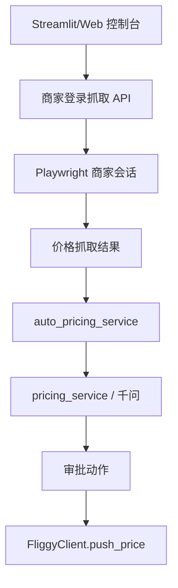

# 变更提案: merchant-price-capture

## 元信息
```yaml
类型: 新功能/修复
方案类型: implementation
优先级: P0
状态: 已确认
创建: 2026-03-14
```

---

## 1. 需求

### 背景
当前项目已经具备飞猪公开页抓取、千问定价建议、人工审批和飞猪 API 推价工作流，但缺少“飞猪商家后台登录态抓取”这一真实业务输入源。同时 Streamlit 控制台默认把后端地址写成 `http://127.0.0.1:8001`，与 README 要求的 `8000` 不一致，导致控制台在抓取和调价调用时容易出现 `WinError 10061`。

### 目标
- 修复 Streamlit 控制台默认后端地址错误，恢复控制台对本地 Flask 后端的可用连接。
- 在现有项目中新增飞猪商家后台登录会话能力，支持持久化浏览器会话并复用。
- 新增从飞猪商家后台酒店页面抓取当前价格与房型价格的接口。
- 将商家后台抓取结果接入现有自动定价上下文，复用千问定价建议和审批后推价链路。
- 保持“改价前人工确认”，不启用无确认自动改价。

### 约束条件
```yaml
时间约束: 本次只实现最小可运行闭环，不引入新的前后端框架。
性能约束: 单次抓取以人工触发为主，可接受 Playwright 秒级等待。
兼容性约束: 保持现有 Flask、Streamlit、SQLAlchemy、Playwright 技术栈不变。
业务约束: 仅允许白名单门店配置商家登录抓取；改价前必须人工确认；未配置飞猪推价模板时不强行自动改价。
```

### 验收标准
- [ ] Streamlit 默认后端地址改为 `http://127.0.0.1:8000`，不再把 `8000` 自动改写成 `8001`。
- [ ] 门店配置支持保存飞猪商家登录 URL、价格页 URL、会话文件名与价格抓取选择器。
- [ ] 新增 API 可执行“登录商家后台并保存会话”和“复用会话抓取商家价格/房型价格”。
- [ ] 抓取结果可回填房态快照/自动定价上下文，并用于现有千问定价建议。
- [ ] 审批后仍走现有 `adjust_price -> FliggyClient.push_price()` 链路，不破坏已有自动定价工作流。

---

## 2. 方案

### 技术方案
采用最小改动接入方案：

- 修复 `backend/streamlit_app.py` 中错误的默认 `base_url`。
- 扩展 `shops` 表、`ShopConfig`、`ShopUpsertRequest` 与 `/shops` 接口，保存飞猪商家抓取所需配置：
  - `fliggy_merchant_login_url`
  - `fliggy_merchant_price_url`
  - `fliggy_merchant_storage_state`
  - `fliggy_merchant_price_selectors_json`
- 在 `competitor_service.py` 中新增飞猪商家 Playwright 服务，支持：
  - 使用账号密码登录并保存会话
  - 使用会话访问价格页并抓取当前价格/房型价格
  - 将抓取结果写入现有房型价格历史或房态快照
- 在 `routes.py` 和 `streamlit_app.py` 中补充商家登录抓取入口。
- 在 `auto_pricing_service.py` 中优先读取商家抓取结果作为当前价格输入，接入现有 `pricing_service` 与 `workflow_service`。

### 影响范围
```yaml
涉及模块:
  - backend/streamlit_app.py: 修复默认连接地址并新增商家登录抓取控制台
  - backend/app/schemas/shop.py: 扩展门店商家抓取配置字段
  - backend/app/schemas/competitor.py: 新增商家登录抓取请求模型
  - backend/app/services/shop_service.py: 扩展 shops 表与门店配置读写
  - backend/app/services/competitor_service.py: 新增商家登录会话与价格抓取实现
  - backend/app/services/auto_pricing_service.py: 接入商家抓取结果作为自动定价输入
  - backend/app/api/routes.py: 暴露商家登录抓取 API
  - backend/app/web/market.py: 补充 Web 控制台入口
  - backend/README.md: 更新使用说明
预计变更文件: 8-10
```

### 风险评估
| 风险 | 等级 | 应对 |
|------|------|------|
| 飞猪商家后台存在验证码或扫码登录 | 高 | 采用“首次人工登录后保存会话”模式，避免强依赖自动过验证码 |
| 页面结构变化导致选择器失效 | 中 | 选择器配置化并落到门店级配置中，而不是硬编码 |
| 抓取结果与现有房态/房型数据结构不一致 | 中 | 统一转成当前项目已有的价格快照/房态结构后再入链路 |
| 未配置飞猪推价模板导致审批后无法真实改价 | 中 | 保持现有失败提示，不回退到无边界的页面自动改价 |

---

## 3. 技术设计（可选）

> 涉及架构变更、API设计、数据模型变更时填写

### 架构设计


### API设计
#### POST /merchant/fliggy/session/login
- **请求**: `shop_id`, `login_url`, `username`, `password`, `headless`, `storage_state_name`
- **响应**: `shop_id`, `status`, `storage_state_path`, `session_saved`

#### POST /merchant/fliggy/prices/collect
- **请求**: `shop_id`, `price_url`, `headless`, `save_result`, `selectors`
- **响应**: `shop_id`, `status`, `captured_price`, `rooms[]`, `saved_count`, `storage_state_used`

### 数据模型
| 字段 | 类型 | 说明 |
|------|------|------|
| fliggy_merchant_login_url | VARCHAR(2048) | 飞猪商家后台登录页 |
| fliggy_merchant_price_url | VARCHAR(2048) | 飞猪商家价格页 |
| fliggy_merchant_storage_state | VARCHAR(255) | 保存的 Playwright 会话文件名 |
| fliggy_merchant_price_selectors_json | LONGTEXT | 价格抓取选择器配置 |

---

## 4. 核心场景

> 执行完成后同步到对应模块文档

### 场景: 飞猪商家后台价格抓取并进入调价链路
**模块**: backend/app/services/competitor_service.py
**条件**: 门店已配置飞猪商家登录 URL、价格页 URL，且已有可用账号
**行为**: 用户在控制台发起商家登录并保存会话，随后复用会话进入价格页抓取当前价格和房型价格
**结果**: 返回结构化价格数据，并可继续送入现有千问定价与审批链路

---

## 5. 技术决策

> 本方案涉及的技术决策，归档后成为决策的唯一完整记录

### merchant-price-capture#D001: 复用现有自动定价工作流，只补商家后台抓取输入源
**日期**: 2026-03-14
**状态**: ✅采纳
**背景**: 当前项目已经具备定价建议、审批、推价与验证链路，缺口主要是“真实商家后台价格输入”。
**选项分析**:
| 选项 | 优点 | 缺点 |
|------|------|------|
| A: 仅新增商家抓取输入源 | 改动最小，最大化复用现有链路 | 仍需维护页面选择器 |
| B: 抓取和改价都改成页面自动化 | 不依赖飞猪 API 模板 | 风险高、脆弱、维护成本大 |
**决策**: 选择方案 A
**理由**: 现有工作流已经覆盖了推荐、审批、推价和验证，补抓取输入源即可形成可运行闭环，工程收益最高。
**影响**: 影响 Streamlit 控制台、shops 配置模型、商家抓取服务、自动定价上下文与 README/知识库同步。
