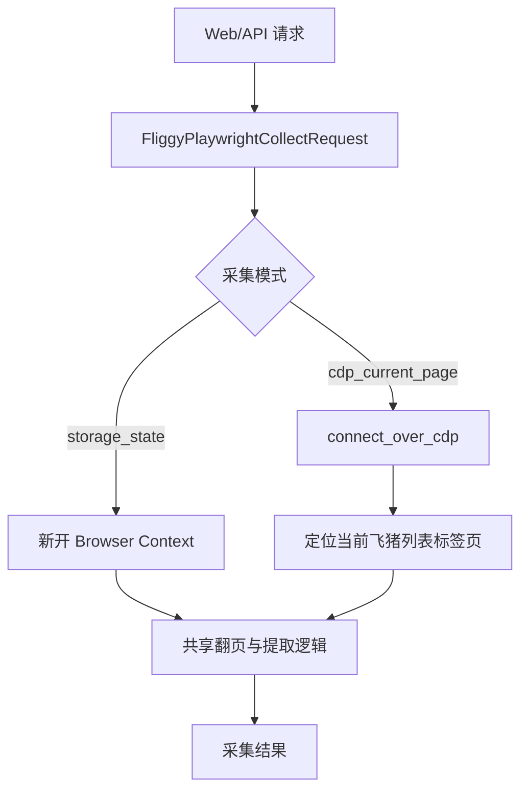

# 变更提案: fliggy-cdp-current-page-collect

## 元信息
```yaml
类型: 新功能
方案类型: implementation
优先级: P1
状态: 已确认
创建: 2026-03-20
```

---

## 1. 需求

### 背景
现有“飞猪游客采集”支持自动登录并保存游客会话，随后由程序新开浏览器或复用 `storage_state` 进行采集。
但当前用户希望直接接管自己手工打开、已经完成登录的 Chrome 标签页，在该页面内继续翻页抓取竞对酒店，而不是再走一次自动登录或保存会话流程。

### 目标
- 为飞猪游客采集新增“CDP 接管当前页”模式。
- 通过本机 Chrome 远程调试端口连接到已登录浏览器，并定位当前飞猪酒店列表页。
- 复用现有 DOM 提取与翻页逻辑，在当前页继续批量抓取酒店价格。
- 保留现有 `storage_state` 采集链路，避免兼容性回归。

### 约束条件
```yaml
时间约束: 本次迭代内完成最小可用改造
性能约束: 不新增重型依赖，沿用现有 Playwright 和提取逻辑
兼容性约束: 旧的保存会话/自动登录采集方式必须继续可用
业务约束: 当前页必须是飞猪酒店列表或搜索结果页，首页不支持采集
```

### 验收标准
- [ ] Web 和 API 均可配置“CDP 接管当前页”模式及调试端口地址
- [ ] 程序可通过 `connect_over_cdp` 接管本机已登录的 Chrome 标签页
- [ ] 在接管的当前页中可继续点击下一页并累计抓取酒店价格
- [ ] 旧的 `storage_state` 模式保持可用，相关测试通过

---

## 2. 方案

### 技术方案
在现有 `collect_fliggy_hotel_prices_playwright()` 链路中新增一种来源模式：
- 默认模式继续沿用“新开 Playwright 浏览器 + 可选 storage state”。
- 新模式通过 Playwright `chromium.connect_over_cdp()` 连接本机 Chrome 调试地址。
- 连接后优先选取当前激活页中满足飞猪酒店列表 URL 条件的标签页；如果提供 `target_page_url_keyword`，则进一步收窄匹配。
- 将当前的“抽取酒店行 + 下一页翻页”逻辑下沉为可复用内部函数，让新旧两条路径共享提取行为和结果结构。

### 影响范围
```yaml
涉及模块:
  - backend/app/schemas/competitor.py: 扩展采集请求字段
  - backend/app/web/market.py: 解析并传递新模式字段
  - backend/app/templates/ops/market/fliggy_collect.html: 增加“接管当前 Chrome”配置项
  - backend/app/api/routes.py: API 入口同步扩展
  - backend/app/services/competitor_service.py: 新增 CDP 接管逻辑并复用现有翻页提取
  - backend/tests/test_competitor_guest_login_flow.py: 补充新模式测试
预计变更文件: 6
```

### 风险评估
| 风险 | 等级 | 应对 |
|------|------|------|
| Chrome 未开启远程调试端口，无法接管 | 中 | 返回明确错误，引导用户使用 `--remote-debugging-port=9222` 启动 |
| 当前页不是飞猪酒店列表页 | 中 | 保持现有 URL 校验并返回明确错误 |
| 多个飞猪标签页导致选错页面 | 中 | 优先当前激活页，并支持 URL 关键字进一步匹配 |
| 新模式改动影响旧会话采集路径 | 低 | 提取共享逻辑，补充回归测试 |

---

## 3. 技术设计（可选）

### 架构设计


### API设计
#### POST /competitor/fliggy/collect
- **请求**: 在现有字段基础上新增 `collect_mode`、`debug_url`、`target_page_url_keyword`
- **响应**: 延续现有采集结果结构，额外返回 `collect_mode` 和命中的页面 URL

### 数据模型
| 字段 | 类型 | 说明 |
|------|------|------|
| collect_mode | str | `storage_state` 或 `cdp_current_page` |
| debug_url | str | Chrome 调试地址，默认 `http://127.0.0.1:9222` |
| target_page_url_keyword | str | 可选，缩小目标标签页匹配范围 |

---

## 4. 核心场景

> 执行完成后同步到对应模块文档

### 场景: 接管当前已登录 Chrome 标签页采集飞猪酒店
**模块**: `backend/app/services/competitor_service.py`
**条件**: 用户已用 `--remote-debugging-port=9222` 启动 Chrome，并在当前激活标签页打开飞猪酒店列表页
**行为**: 程序连接 CDP，定位当前飞猪列表页，读取页面酒店价格并继续点击下一页
**结果**: 返回与原采集链路一致的酒店价格结果，并标注来源模式为 `cdp_current_page`

---

## 5. 技术决策

> 本方案涉及的技术决策，归档后成为决策的唯一完整记录

### fliggy-cdp-current-page-collect#D001: 采用 CDP 直接接管当前标签页，而非复制登录态新开页
**日期**: 2026-03-20
**状态**: ✅采纳
**背景**: 用户明确要求基于自己已经登录并打开的页面继续翻页抓取，而不是新开页面或仅复用登录态。
**选项分析**:
| 选项 | 优点 | 缺点 |
|------|------|------|
| A: 直接接管当前标签页 | 最符合需求；无需重复登录；可沿用当前页上下文 | 需要处理调试端口和页签定位 |
| B: 复制登录态后新开页 | 对用户当前页干扰更小 | 不满足“当前页面继续抓取”的原始目标 |
**决策**: 选择方案A
**理由**: 与用户目标一致，且能最大化复用现有翻页提取逻辑，改造面可控。
**影响**: 影响采集 schema、Web/API 入口、Playwright 采集 service 及对应测试。
