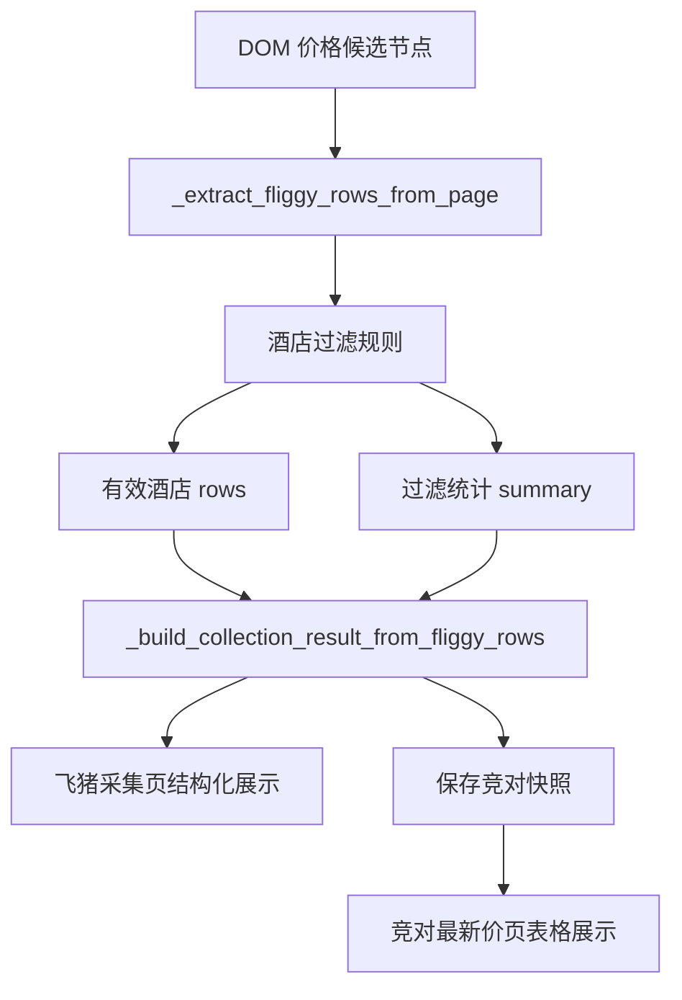

# 变更提案: fliggy-hotel-filter-console

## 元信息
```yaml
类型: 修复/优化
方案类型: implementation
优先级: P1
状态: 已确认
创建: 2026-03-20
```

---

## 1. 需求

### 背景
飞猪游客采集已经支持通过 `cdp_current_page` 接管用户当前已登录的 Chrome 标签页，并成功抓取酒店列表价格。
但当前提取逻辑只根据 DOM 文本中的价格信号抓取候选项，导致“机票特价”“航线价格”等非酒店卡片也会被当作酒店写入结果和数据库，操作台目前又仅直接输出原始 JSON，用户无法快速判断采集质量。

### 目标
- 收紧飞猪酒店卡片识别逻辑，过滤明显非酒店项。
- 在采集结果中增加过滤统计与过滤样例，便于判断本次采集质量。
- 在 Web 操作台中把有效酒店、过滤统计和最新价结果结构化展示出来。
- 保持现有 `storage_state` 与 `cdp_current_page` 两种采集模式可用。

### 约束条件
```yaml
时间约束: 本次迭代内完成最小闭环修复
性能约束: 继续沿用现有 Playwright DOM 抽取链路，不新增重型依赖
兼容性约束: 已有采集接口与入库结构保持兼容，旧模式不可回归
业务约束: 过滤规则应优先保留酒店卡片，避免因规则过严导致酒店漏抓
```

### 验收标准
- [ ] 飞猪采集结果不再混入明显机票/航线价格卡片
- [ ] 采集结果返回 `raw_row_count`、`kept_row_count`、`filtered_row_count`、`filter_summary`、`filtered_examples`
- [ ] 飞猪采集页可直接查看有效酒店表格与过滤统计，不再只依赖原始 JSON
- [ ] 竞对最新价页以结构化表格展示酒店名、价格、来源和时间
- [ ] 新增针对过滤规则和统计字段的测试，并通过定向验证

---

## 2. 方案

### 技术方案
在现有 `_extract_fliggy_rows_from_page()` 链路中增加“候选提取 + 服务端规则过滤”两层处理：
- 第一层继续从 DOM 中提取带价格的候选节点，保留 `name/text/href`。
- 第二层基于酒店 URL 特征、酒店语义信号和排除词做综合判断，产出保留列表与过滤统计。
- `_build_collection_result_from_fliggy_rows()` 扩展输出结构，附带过滤统计和被过滤样例。
- Web 模板消费这些新字段，展示统计卡、有效酒店表格、过滤样例与辅助 JSON。
- 最新竞对价页从已有结构化结果中直接渲染酒店价目表。

### 影响范围
```yaml
涉及模块:
  - backend/app/services/competitor_service.py: 收紧提取逻辑并补充统计字段
  - backend/app/templates/ops/market/fliggy_collect.html: 结果区改为结构化展示
  - backend/app/templates/ops/market/competitor_latest_prices.html: 最新价页面改为表格展示
  - backend/tests/test_competitor_guest_login_flow.py: 补过滤规则与统计字段测试
  - .helloagents/modules/market_collection.md: 更新模块行为文档
  - .helloagents/CHANGELOG.md: 记录本次修复
预计变更文件: 6
```

### 风险评估
| 风险 | 等级 | 应对 |
|------|------|------|
| 过滤规则过严导致真实酒店漏抓 | 中 | 使用“酒店信号命中即可保留，非酒店词强命中才排除”的组合规则，并保留过滤样例便于复盘 |
| 页面模板展示过度依赖新增字段 | 低 | 对缺失字段做默认兜底，保留原始 JSON 辅助区 |
| 旧采集模式结果结构被破坏 | 低 | 仅新增字段，不移除现有 `items/count/meta` 等结构 |

---

## 3. 技术设计（可选）

### 架构设计


### 数据模型
| 字段 | 类型 | 说明 |
|------|------|------|
| raw_row_count | int | 原始候选行数 |
| kept_row_count | int | 过滤后保留的酒店数 |
| filtered_row_count | int | 被过滤的候选数 |
| filter_summary | dict | 按原因汇总的过滤统计 |
| filtered_examples | list[dict] | 被过滤样例，便于控制台排查 |

---

## 4. 核心场景

> 执行完成后同步到对应模块文档

### 场景: 在当前已登录飞猪页面过滤噪声并查看有效酒店
**模块**: `backend/app/services/competitor_service.py`
**条件**: 用户已通过保存会话或 CDP 接管方式打开飞猪酒店列表页
**行为**: 程序抓取候选卡片，对非酒店价格项进行过滤，并返回有效酒店与过滤统计
**结果**: 操作台显示有效酒店价格表与过滤样例，数据库仅写入酒店结果

### 场景: 在操作台查看数据库中的竞对最新价
**模块**: `backend/app/templates/ops/market/competitor_latest_prices.html`
**条件**: 数据库中已存在竞对快照
**行为**: 页面查询最新竞对价并按酒店维度结构化展示
**结果**: 用户可直接看到酒店名、价格、来源与采集时间

---

## 5. 技术决策

> 本方案涉及的技术决策，归档后成为决策的唯一完整记录

### fliggy-hotel-filter-console#D001: 在服务层过滤飞猪非酒店价格项，而不是只在前端隐藏
**日期**: 2026-03-20
**状态**: ✅采纳
**背景**: 当前问题不仅是页面显示难看，更是采集结果已经被脏数据污染，并会继续写入数据库。
**选项分析**:
| 选项 | 优点 | 缺点 |
|------|------|------|
| A: 服务层过滤并返回统计 | 源头干净、入库干净、前端展示可复用 | 需要同时改 service、模板和测试 |
| B: 仅前端隐藏非酒店项 | 改动少、见效快 | 数据库和后续查询仍被污染 |
**决策**: 选择方案A
**理由**: 这是最小但完整的闭环修复，既解决当前页展示，也避免后续最新价页面持续受污染。
**影响**: 影响飞猪采集 service、结果结构、操作台模板、测试与知识库文档。