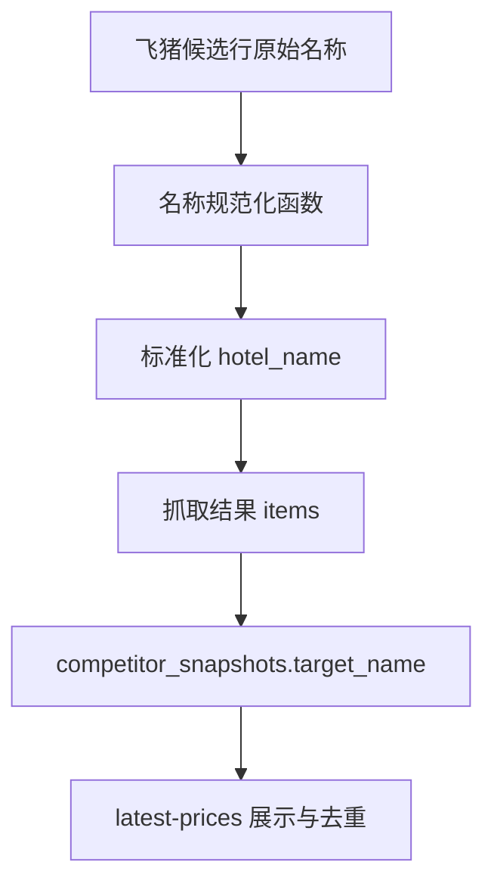

# 变更提案: fliggy-hotel-name-normalization

## 元信息
```yaml
类型: 优化
方案类型: implementation
优先级: P1
状态: 已确认
创建: 2026-03-21
```

---

## 1. 需求

### 背景
飞猪竞对抓取链路已经能稳定复用已登录浏览器并完成入库，但当前酒店名清洗仍停留在基础空白折叠层面。抓取结果中可能混入“立减”“会员价”等营销尾词，以及不可见字符、私有区字符等异常内容，最终会进入 `competitor_snapshots.target_name`，影响 `latest-prices` 展示和按酒店名去重的稳定性。

### 目标
- 在飞猪酒店结果提取阶段引入可控的酒店名规范化逻辑。
- 清理营销尾词、异常不可见字符与私有区字符，同时尽量保留酒店主体名称。
- 通过回归测试保证现有价格提取、非酒店过滤与控制台链路不回退。

### 约束条件
```yaml
时间约束: 本轮仅推进工作记录中的第一优先建议，不扩展到历史数据批量清洗。
性能约束: 不引入额外网络请求，不显著增加单页解析复杂度。
兼容性约束: 保持 collect 结果结构、latest-prices 返回结构与现有控制台入口兼容。
业务约束: 规范化规则应保守，避免误删酒店正式名称中的有效词。
```

### 验收标准
- [ ] 飞猪抓取结果中的酒店名可去除常见营销尾词、不可见字符和私有区字符。
- [ ] `latest-prices` 与入库名称使用规范化后的稳定酒店名，不破坏现有字段结构。
- [ ] 新增或更新的测试可覆盖典型脏样本与既有抓取链路。

---

## 2. 方案

### 技术方案
在 `backend/app/services/competitor_service.py` 中新增专门的酒店名规范化函数，并在飞猪候选行进入标准化结果前调用。该函数将分层执行：

1. 统一空白、去除零宽字符和私有区字符。
2. 剥离尾随营销词，例如“立减”“会员价”“限时抢购”等明显非酒店主体信息。
3. 对清洗结果做二次 trim，必要时保留原名回退，避免输出空字符串。

测试层面优先补充 `backend/tests/test_competitor_service.py` 的专项断言；如提取链路已有更贴近真实场景的断言位置，再补充 `backend/tests/test_competitor_guest_login_flow.py` 的结果校验。

### 影响范围
```yaml
涉及模块:
  - market_collection: 影响飞猪酒店名称从提取、入库到 latest-prices 展示的统一性
  - competitor_service: 增加名称规范化逻辑并接入提取链路
  - tests: 补充名称清洗与链路回归断言
预计变更文件: 2-3
```

### 风险评估
| 风险 | 等级 | 应对 |
|------|------|------|
| 规则过强导致酒店正式名称被误删 | 中 | 采用“尾词剥离优先、整串替换谨慎”的保守策略，并用典型样本回归约束 |
| 规范化后影响历史去重口径 | 低 | 本轮仅保证新采集结果更稳定，历史数据清洗留到后续独立任务 |
| 提取链路回归破坏现有过滤逻辑 | 低 | 保留现有价格提取与非酒店过滤逻辑，只在名称落库前增加规范化步骤 |

---

## 3. 技术设计（可选）

> 本次不涉及架构、API 或数据库结构变更，跳过。

### 架构设计


### API设计
本次无 API 变更。

### 数据模型
| 字段 | 类型 | 说明 |
|------|------|------|
| competitor_snapshots.target_name | VARCHAR(128) | 字段结构不变，仅写入值改为规范化后的酒店名 |

---

## 4. 核心场景

> 执行完成后同步到对应模块文档

### 场景: 飞猪酒店名规范化后入库
**模块**: market_collection
**条件**: 飞猪页面候选卡片已通过价格提取与酒店过滤，名称中存在营销尾词或异常字符
**行为**: 服务层在生成标准 `hotel_name` 前执行规范化
**结果**: 入库和展示使用稳定酒店主体名，减少同酒店因脏尾词导致的重复记录

---

## 5. 技术决策

> 本方案涉及的技术决策，归档后成为决策的唯一完整记录

### fliggy-hotel-name-normalization#D001: 在提取阶段而非展示阶段执行酒店名规范化
**日期**: 2026-03-21
**状态**: ✅采纳
**背景**: 酒店名脏数据一旦进入抓取结果和数据库，会同时影响控制台展示、最新价查询和名称去重。如果只在展示层清理，链路不同层的名称口径会不一致。
**选项分析**:
| 选项 | 优点 | 缺点 |
|------|------|------|
| A: 提取阶段规范化 | 抓取、入库、展示口径统一；影响面集中在 service 层 | 需要谨慎设计规则，避免过度清洗 |
| B: 入库或展示阶段规范化 | 改动看似更小 | 链路口径不一致，排查与测试更复杂 |
**决策**: 选择方案 A
**理由**: 当前任务目标是以最小改动提高数据质量，而提取阶段是酒店名首次稳定落点；在这里清洗可以一次性覆盖后续链路，同时不需要修改 API 或数据库结构。
**影响**: 影响 `competitor_service` 的飞猪提取链路，以及相关单元测试与链路测试
