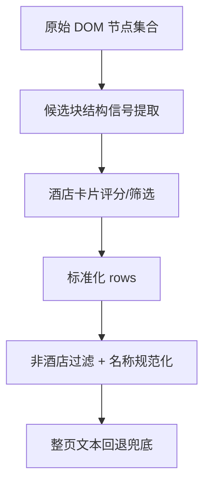

# 变更提案: fliggy-list-block-parser-hardening

## 元信息
```yaml
类型: 优化
方案类型: implementation
优先级: P1
状态: 已确认
创建: 2026-03-21
```

---

## 1. 需求

### 背景
飞猪竞对抓取当前已经具备非酒店过滤、名称规范化和结果统计能力，但列表块提取主路径仍然较粗放：会对大量通用节点做统一扫描，然后依赖后置过滤和整页文本回退兜底。这使得不同城市、不同列表样式下的稳定性仍然不足，尤其在 DOM 结构较弱但仍存在卡片语义时，容易过早落入整页文本回退。

### 目标
- 增强飞猪 DOM 列表块识别与筛选逻辑，提高酒店卡片提取命中率。
- 减少对整页文本回退的依赖，让回退链路只承担兜底职责。
- 保持现有非酒店过滤、名称规范化、结果统计与返回结构不回退。

### 约束条件
```yaml
时间约束: 本轮只推进工作记录中的第二优先建议，不扩展到历史数据清洗或控制台新功能。
性能约束: 不引入额外网络请求，不显著放大单页节点遍历成本。
兼容性约束: 保持 collect 结果结构、latest-prices 结构与现有测试接口兼容。
业务约束: 仍需优先保留真实酒店卡片，避免为了收紧规则而漏抓弱结构页面中的酒店项。
```

### 验收标准
- [ ] 存在酒店列表块 DOM 时，优先通过块级结构信号提取酒店卡片，而不是依赖整页文本回退。
- [ ] 不同列表样式下仍能稳定得到 `hotel_name`、`price`、`url`，且保留非酒店过滤和名称规范化。
- [ ] 新增或更新的回归测试覆盖多样式列表块场景，并通过定向测试。

---

## 2. 方案

### 技术方案
在 `backend/app/services/competitor_service.py` 中增强 `_extract_fliggy_rows_from_page()` 的 DOM 主路径，核心做法如下：

1. 为候选节点增加结构化信号提取，例如名称候选、价格候选、详情链接、酒店上下文信号。
2. 引入块级评分或命中规则，优先保留更像“酒店卡片”的节点，减少泛节点误入。
3. 保持整页文本回退链路存在，但仅在 DOM 主路径结果明显不足时触发。
4. 补充多种 DOM 列表块样式的回归测试，验证弱结构页面与现有过滤逻辑共存。

### 影响范围
```yaml
涉及模块:
  - market_collection: 影响飞猪列表块识别稳定性与主提取路径命中率
  - competitor_service: 增强列表块提取与卡片级信号判断逻辑
  - tests: 补充多样式列表块场景下的回归测试
预计变更文件: 2-3
```

### 风险评估
| 风险 | 等级 | 应对 |
|------|------|------|
| 规则收紧后误漏弱结构酒店卡片 | 中 | 使用组合信号而非单一硬过滤，并用弱结构测试样本约束 |
| 节点遍历更复杂导致性能回退 | 低 | 保持单页内局部打分，不引入额外请求或多轮扫描 |
| 过度依赖具体 CSS 语义导致页面改版脆弱 | 中 | 采用通用结构信号优先，避免强绑定特定 class 名 |

---

## 3. 技术设计（可选）

> 本次不涉及 API 或数据库结构变更，重点是提取链路内部策略调整。

### 架构设计


### API设计
本次无 API 变更。

### 数据模型
| 字段 | 类型 | 说明 |
|------|------|------|
| result.rows | list[dict] | 结构不变，仅提升 DOM 主路径提取质量 |

---

## 4. 核心场景

> 执行完成后同步到对应模块文档

### 场景: 多样式列表块下的酒店卡片识别
**模块**: market_collection
**条件**: 飞猪页面存在不同层级、不同标签组合的酒店列表块，且节点中可见价格、酒店名称和详情语义
**行为**: 服务层基于结构信号优先抽取更像酒店卡片的 DOM 节点，并在不足时再回退到整页文本扫描
**结果**: 主提取路径对列表块 DOM 更稳定，整页文本回退触发频率下降

---

## 5. 技术决策

> 本方案涉及的技术决策，归档后成为决策的唯一完整记录

### fliggy-list-block-parser-hardening#D001: 优先增强 DOM 候选块识别，而不是重写整条回退链路
**日期**: 2026-03-21
**状态**: ✅采纳
**背景**: 当前问题核心在于 DOM 主路径对酒店列表块的识别能力不足，导致整页文本回退被过度依赖。如果直接重写为全新多层解析器，范围会明显扩大。
**选项分析**:
| 选项 | 优点 | 缺点 |
|------|------|------|
| A: 增强 DOM 候选块打分与筛选 | 改动收敛，能直接提升主路径稳定性，兼容现有过滤与规范化成果 | 需要谨慎平衡召回与精度 |
| B: 重写整条解析链路 | 结构更理想，扩展空间更大 | 范围过大，回归面更宽，不适合当前最小推进 |
**决策**: 选择方案 A
**理由**: 这是对当前实现最小、最稳的演进路径，能先解决“DOM 主路径过弱”的核心问题，再决定是否有必要做更大规模重构。
**影响**: 影响 `competitor_service` 中列表块提取逻辑，以及飞猪采集回归测试集合