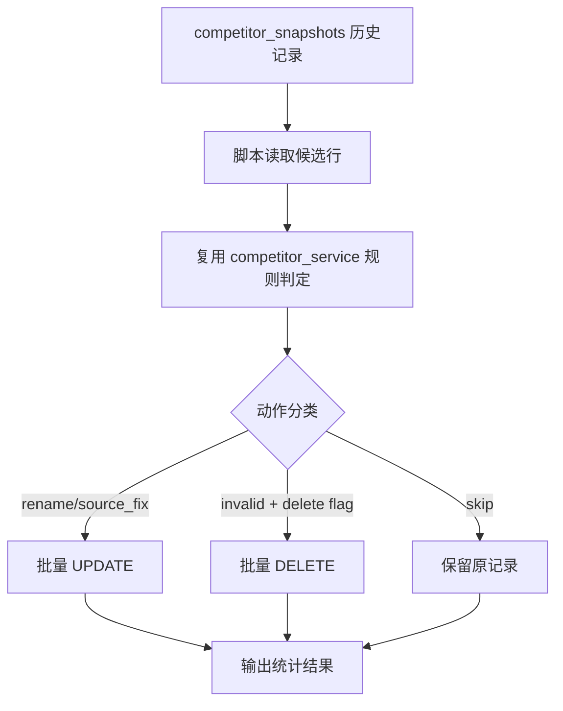

# 变更提案: competitor-snapshot-cleanup-script

## 元信息
```yaml
类型: 优化
方案类型: implementation
优先级: P1
状态: 已确认
创建: 2026-03-21
```

---

## 1. 需求

### 背景
当前 `competitor_snapshots` 已经累积了一批历史竞对快照，其中包含早期采集链路遗留的脏名称、非标准 `source`，以及少量明显不应保留在竞对历史中的无效快照。近期飞猪列表块解析和酒店名规范化已经增强，但这些改进只对后续新数据生效，旧数据仍会继续污染最新价格去重、趋势聚合和定价上下文。

### 目标
- 提供一个可重复执行的一次性清洗脚本，用于按规则批量处理历史 `competitor_snapshots`。
- 统一旧快照的 `target_name` 和可识别的 `source`，让历史数据与当前采集规范对齐。
- 为明显无效的历史快照提供显式清理能力，避免继续手工清表。

### 约束条件
```yaml
时间约束: 本轮只交付脚本、规则复用和必要测试，不扩展控制台入口或后台定时任务。
性能约束: 脚本按批处理历史记录，不引入线上接口额外开销；默认 dry-run，避免大表误操作。
兼容性约束: 不修改 competitor_snapshots 表结构，不改变现有 API 返回格式。
业务约束: 清洗后必须兼容市场页、趋势页和自动定价对 target_name 的现有精确匹配逻辑。
```

### 验收标准
- [ ] 存在可执行脚本，支持按 `shop_id`、时间范围和 `source` 过滤历史快照，并默认 `dry-run` 预览。
- [ ] 脚本可批量规范化旧快照 `target_name`，并修正常见脏 `source` 到当前规范值。
- [ ] 对明显无效的快照提供显式清理开关，且不会在默认模式下直接执行删除。
- [ ] 新增或更新的单元测试覆盖名称规范化、来源修正和无效快照判定规则，并通过定向测试。

---

## 2. 方案

### 技术方案
采用“服务层规则复用 + 独立脚本执行”的最小落地方案：

1. 在 `backend/app/services/competitor_service.py` 中补充历史快照清洗所需的轻量辅助函数，复用现有酒店名规范化、价格识别和非酒店判定能力。
2. 新增 `backend/scripts/clean_competitor_snapshots.py`，复用 `SessionLocal` 建立数据库会话，对 `competitor_snapshots` 做分批扫描和规则分类。
3. 脚本输出清洗预览统计，包括待更新数量、待删除数量、命中规则摘要和样例记录；默认仅预览，不落库。
4. 在显式执行模式下：
   - 原地更新 `target_name`
   - 修正可识别的脏 `source`
   - 按显式开关删除明显无效快照
5. 对规则层补充测试，确保新旧采集逻辑对同一名称规范化标准保持一致。

### 影响范围
```yaml
涉及模块:
  - market_collection: 历史竞对快照将与当前飞猪采集规则对齐
  - competitor_service: 新增历史清洗复用规则，服务层和脚本共用
  - scripts: 新增一次性清洗脚本
  - tests: 补充历史清洗规则回归测试
预计变更文件: 3
```

### 风险评估
| 风险 | 等级 | 应对 |
|------|------|------|
| 误删真实酒店快照 | 中 | 删除动作默认关闭，只在 dry-run 预览后通过显式参数开启 |
| 名称归一后影响既有 target_name 精确匹配 | 中 | 仅复用现有酒店名规范化规则，并用测试约束新旧行为一致 |
| 历史 source 取值过杂导致映射不完整 | 低 | 先覆盖已识别脏值，未知值保持原样并在预览统计中暴露 |

---

## 3. 技术设计（可选）

> 本次不涉及 API 或表结构变更，重点是脚本执行路径和清洗规则设计。

### 架构设计


### API设计
本次无 API 变更。

### 数据模型
| 字段 | 类型 | 说明 |
|------|------|------|
| target_name | VARCHAR(128) | 旧快照酒店名称，必要时按现有规则归一 |
| source | VARCHAR(32) | 历史采集来源，可映射到标准来源值 |
| signals_json | JSON | 读取其中的 `title`、`snippet`、`price_signals` 辅助判定 |
| target_url | VARCHAR(1024) | 用于辅助识别登录页、主页或非酒店链接 |
| fetch_status | VARCHAR(32) | 清洗脚本判定无效时作为辅助判断条件，不依赖其单独决定删除 |

---

## 4. 核心场景

> 执行完成后同步到对应模块文档

### 场景: 历史竞对快照批量清洗预览
**模块**: market_collection
**条件**: `competitor_snapshots` 中存在历史脏名称、脏来源或明显无效记录
**行为**: 运维通过脚本按 `shop_id`、时间范围或 `source` 过滤数据，先执行 `dry-run` 查看拟更新和拟删除结果
**结果**: 在真正落库前先确认影响范围和命中规则样例

### 场景: 历史竞对快照正式清洗
**模块**: market_collection
**条件**: 已完成 dry-run 预览，并明确需要修正名称、来源或删除无效快照
**行为**: 脚本批量更新 `target_name` / `source`，并在显式删除开关开启时清理明显无效快照
**结果**: 最新价格、趋势页和定价上下文读取到的历史快照更干净且名称更稳定

---

## 5. 技术决策

> 本方案涉及的技术决策，归档后成为决策的唯一完整记录

### competitor-snapshot-cleanup-script#D001: 复用现有 competitor_service 规则，而不是在脚本里另写一套历史清洗规则
**日期**: 2026-03-21
**状态**: ✅采纳
**背景**: 当前飞猪采集链路已经具备名称规范化和非酒店识别逻辑。如果历史清洗脚本重新维护一套正则和判定规则，后续很容易再次漂移。
**选项分析**:
| 选项 | 优点 | 缺点 |
|------|------|------|
| A: 复用 `competitor_service` 现有规则 | 线上新数据与历史清洗保持同一标准，维护成本低 | 需要在服务层补少量可复用辅助函数 |
| B: 在脚本里单独实现规则 | 脚本独立性更强 | 规则重复，后续容易与线上采集行为分叉 |
**决策**: 选择方案 A
**理由**: 本次任务的核心是“补齐历史数据”，不是再造一套清洗体系。规则复用能最大限度减少后续维护偏差。
**影响**: 影响 `backend/app/services/competitor_service.py` 和新增清洗脚本的实现边界

### competitor-snapshot-cleanup-script#D002: 无效快照采用“默认预览 + 显式删除开关”策略
**日期**: 2026-03-21
**状态**: ✅采纳
**背景**: 明显无效快照如果只做标记，仍可能继续出现在趋势接口和最新快照列表中；但直接默认删除又存在误删风险。
**选项分析**:
| 选项 | 优点 | 缺点 |
|------|------|------|
| A: 默认直接删除无效快照 | 清理最彻底 | 风险高，容易误删 |
| B: 默认只预览，删除需显式参数开启 | 风险可控，符合一次性清洗场景 | 使用者需要多一步确认 |
**决策**: 选择方案 B
**理由**: 这是兼顾数据安全和清理效果的最稳方案，尤其适合历史大表的一次性治理。
**影响**: 影响清洗脚本参数设计、输出格式和执行流程
