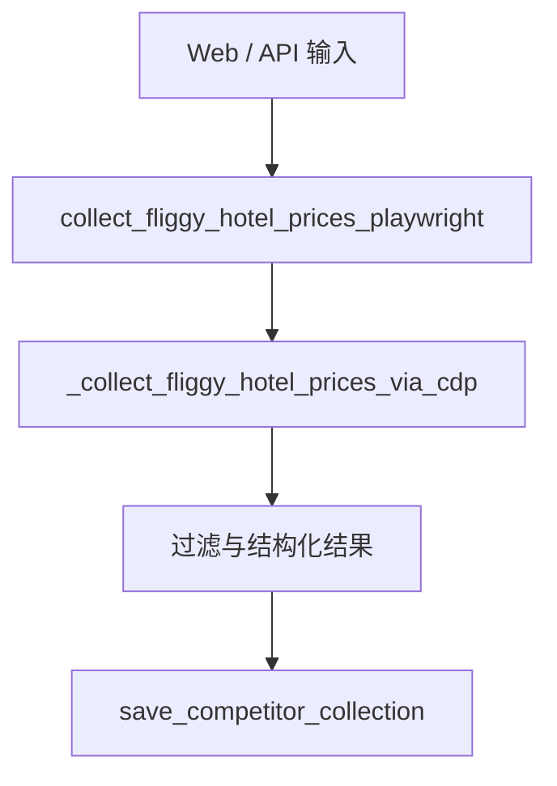

# 变更提案: fliggy-guest-cdp-only

## 元信息
```yaml
类型: 修复/收敛
方案类型: implementation
优先级: P1
状态: 已确认方案
创建: 2026-03-27
```

---

## 1. 需求

### 背景
当前游客竞对抓取链路虽然已经支持 `cdp_current_page`，但默认行为仍是“优先接管当前已登录浏览器，失败后回退到 `storage_state` 或自动游客登录”。这会把明确不允许的“游客自动化登录”路径继续保留在服务层、Web 表单和 API 入口中，造成系统行为与真实需求不一致。

### 目标
- 游客抓价链路只允许接管当前已登录的游客页面，不再使用游客自动化登录。
- 统一 Web / API / schema / 测试的行为定义，避免入口和服务层语义分裂。
- 在 CDP 无法接管当前页时直接给出明确错误，而不是静默回退到其他链路。

### 约束条件
```yaml
时间约束: 仅收敛现有游客竞对链路，不扩散到商家抓价链路。
性能约束: 不新增额外浏览器实例与登录重试，不增加抓取阶段额外等待。
兼容性约束: 保持已有 CDP 当前页接管能力和数据库落库能力可用；如外部调用仍传入旧参数，应返回清晰错误或被入口层消化。
业务约束: 采集前提改为“用户必须自己以远程调试模式打开并登录浏览器页面”；系统不再替用户完成游客账号登录。
```

### 验收标准
- [ ] `collect_fliggy_hotel_prices_playwright` 在游客链路中仅支持 `cdp_current_page`，不再回退到 `storage_state` 或 `auto_login`。
- [ ] 游客抓取页面不再暴露游客账号、密码、保存会话、自动登录等配置项。
- [ ] API / Web 默认值与可选值统一为“接管当前已登录页面”。
- [ ] 测试覆盖成功接管与接管失败两种结果，并删除对 fallback 行为的断言。

---

## 2. 方案

### 技术方案
采用“链路收敛”方案，直接把游客竞对抓价入口从双路径模型改成单路径模型。

具体执行如下：
- 服务层：在 `collect_fliggy_hotel_prices_playwright` 中去掉 `prefer_cdp` 的 fallback 逻辑，以及 `storage_state + auto_login` 的自动登录补偿逻辑；游客链路统一走 `_collect_fliggy_hotel_prices_via_cdp`。
- Schema / API：将游客抓价请求的默认 `collect_mode` 改为 `cdp_current_page`，并停止在入口层传递游客用户名、密码、`storage_state_name`、`auto_login`、`login_headless` 等仅服务于旧链路的字段。
- Web 模板：重写游客抓取页的说明文案与表单结构，只保留 CDP 调试地址、目标页关键字、起始 URL、翻页和落库相关参数。
- 测试：删除“prefer_cdp 失败后回退到 saved session”的行为验证，新增“CDP 失败直接报错”的断言，确保后续不会再次引回旧链路。

### 影响范围
```yaml
涉及模块:
  - backend/app/services/competitor_service.py: 收敛游客抓价主逻辑，移除 storage_state/auto_login fallback。
  - backend/app/schemas/competitor.py: 调整游客抓价请求默认值与允许输入语义。
  - backend/app/web/market.py: 精简游客抓价表单数据组装与服务调用参数。
  - backend/app/api/routes.py: 精简游客抓价 API 透传字段。
  - backend/app/templates/ops/market/fliggy_collect.html: 移除游客自动化登录与保存会话入口，更新操作说明。
  - backend/tests/test_competitor_guest_login_flow.py: 更新测试预期，锁定“仅接管当前页”行为。
预计变更文件: 5-6
```

### 风险评估
| 风险 | 等级 | 应对 |
|------|------|------|
| 仍有旧前端或 API 调用传入 `prefer_cdp` / `storage_state` | 中 | 在服务层统一规范化或直接拒绝，避免静默执行旧逻辑。 |
| 用户未按要求用远程调试端口打开已登录浏览器 | 中 | 页面文案和错误信息明确提示启动方式与调试地址。 |
| 删除 fallback 后导致“偶尔还能抓到”的侥幸路径消失 | 低 | 这是符合真实业务约束的预期变化，测试同步更新并显式记录。 |

---

## 3. 技术设计（可选）

> 本次不涉及数据库模型变更，主要是链路裁剪与入口收敛。

### 架构设计


### API设计
#### POST /competitor/fliggy/collect
- **请求**: 保留 `shop_id`, `start_url`, `max_pages`, `max_hotels`, `headless`, `save_result`, `debug_url`, `target_page_url_keyword`, `collect_mode=cdp_current_page`。
- **响应**: 返回 `collect_mode=cdp_current_page`、匹配页面信息、采集结果与过滤摘要；接管失败时返回明确错误，不再返回 `cdp_fallback_reason + storage_state` 成功结果。

### 数据模型
| 字段 | 类型 | 说明 |
|------|------|------|
| collect_mode | str | 游客链路固定为 `cdp_current_page` |
| debug_url | str | Chromium 远程调试地址 |
| target_page_url_keyword | str | 当前页筛选关键字 |

---

## 4. 核心场景

### 场景: 接管当前已登录游客页面抓价
**模块**: `backend/app/services/competitor_service.py`
**条件**: 用户已用远程调试模式打开 Chrome / Edge，并停留在已登录的飞猪酒店列表页。
**行为**: 系统连接调试地址，锁定当前页或匹配关键字页面，读取酒店价格并做过滤。
**结果**: 返回 `cdp_current_page` 模式的价格数据，可继续落库。

### 场景: 未开启远程调试或当前页不匹配
**模块**: `backend/app/templates/ops/market/fliggy_collect.html`
**条件**: 用户未准备好已登录调试页面，或 `debug_url` 无法连接。
**行为**: 系统直接报错并给出使用远程调试浏览器的提示。
**结果**: 请求终止，不再尝试游客自动登录或使用历史会话补救。

---

## 5. 技术决策

### fliggy-guest-cdp-only#D001: 游客竞对抓价只保留 CDP 当前页接管
**日期**: 2026-03-27
**状态**: ✅采纳
**背景**: 业务前提已明确禁止游客自动化登录。继续保留 fallback 会让系统表现与真实约束相违背，并在页面上给出误导性选项。
**选项分析**:
| 选项 | 优点 | 缺点 |
|------|------|------|
| A: 保留 `prefer_cdp`，失败后回退到会话/自动登录 | 对未准备调试浏览器的场景更“宽容” | 违背真实业务约束，且行为不透明 |
| B: 仅保留 `cdp_current_page` | 行为单一、符合当前需求、问题暴露直接 | 对用户准备环境提出明确要求 |
**决策**: 选择方案B
**理由**: 当前任务不是提升兜底能力，而是消灭不允许存在的游客自动化登录链路。
**影响**: 影响游客抓价服务、入口、页面与测试，但不影响商家抓价链路。
