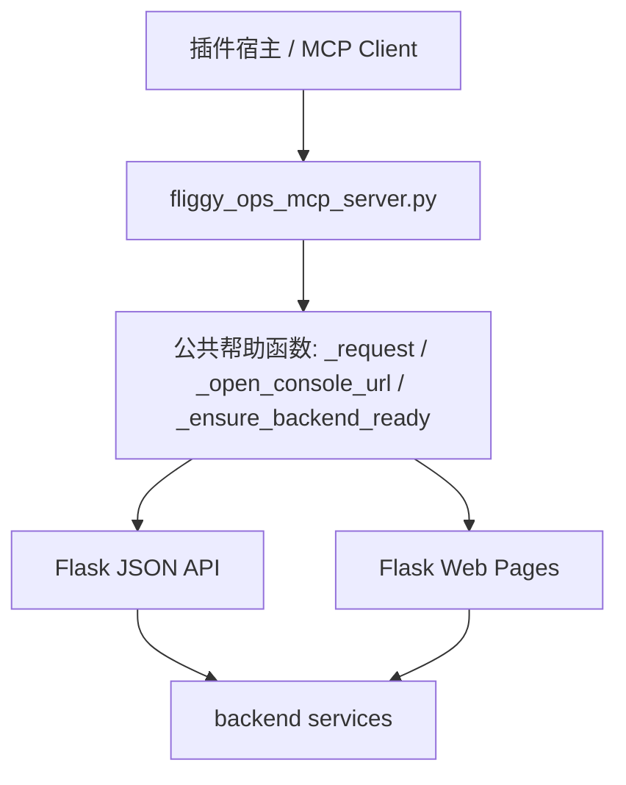

# 变更提案: fliggy-ops-plugin-coverage

## 元信息
```yaml
类型: 新功能
方案类型: implementation
优先级: P1
状态: 已选定方案
创建: 2026-04-06
```

---

## 1. 需求

### 背景
当前 `plugins/fliggy-ops` 只提供少量 MCP 工具，更多像本地插件壳，而不是一个能覆盖项目主流程的可用插件。现有项目的真实能力主要沉淀在 `backend` 的 Flask 页面与 JSON API 中，包括竞对采集、房态分析、商家凭据管理、商家映射、商家采价与改价流程。用户希望以“项目现有代码和页面”为准检查插件功能覆盖度，并补齐明显缺口。

### 目标
- 让 `fliggy-ops` 插件具备覆盖当前项目主要运营链路的 MCP 能力。
- 保持 `backend` 为唯一业务事实来源，插件只补映射层，不重复实现业务逻辑。
- 补充自动化测试，验证新增 MCP 工具与目标 API/页面映射正确。

### 约束条件
```yaml
时间约束: 本轮优先补齐主要功能，不做浏览器扩展与后端架构重构
性能约束: 插件层保持轻量包装，不引入额外长链路或后台常驻状态
兼容性约束: 兼容现有 Windows 本地运行方式、backend/.venv、Flask 页面与 API 路径
业务约束: 保留真实改价的人工确认闸门，不绕过现有租户/门店 Header 校验
```

### 验收标准
- [ ] 插件 MCP 工具覆盖房态分析、商家凭据、商家会话、商家映射、商家改价、定价推荐等当前主要项目能力。
- [ ] 插件继续复用现有 `backend` API 和页面，不新增重复业务实现。
- [ ] README 或插件说明同步更新，能反映新的工具能力与边界。
- [ ] 至少有一组针对 MCP bridge 的自动化测试通过，覆盖新增工具映射或关键帮助函数。

---

## 2. 方案

### 技术方案
采用“仅补 MCP 映射层”的最小变更方案：

- 继续保留 `plugins/fliggy-ops/scripts/fliggy_ops_mcp_server.py` 作为唯一 MCP bridge。
- 在 bridge 内新增两类能力：
  - API 工具：把现有 `backend/app/api/routes.py` 中已存在但插件未暴露的能力映射为 MCP tools。
  - 页面入口工具：为现有 Flask Web 控制台页面提供直达入口，便于插件宿主快速跳转到真实页面。
- 保持 `backend` 业务逻辑不动，除非测试或插件兼容性需要做极小配套改动。
- 新增桥接层测试，重点校验请求路径、参数组装、页面 URL 映射与本地启动逻辑。

### 影响范围
```yaml
涉及模块:
  - plugins/fliggy-ops/scripts/fliggy_ops_mcp_server.py: 扩展 MCP 工具集合与公共帮助函数
  - plugins/fliggy-ops/README.md: 更新插件能力说明与本地使用方式
  - backend/tests: 新增或扩展 MCP bridge 自动化测试
  - plugins/fliggy-ops/.codex-plugin/plugin.json: 如有必要同步默认提示词或能力描述
预计变更文件: 3-4
```

### 风险评估
| 风险 | 等级 | 应对 |
|------|------|------|
| MCP 工具数量增加后脚本可读性下降 | 中 | 提炼统一请求/打开页面帮助函数，按能力分组组织工具 |
| 页面或 API 路径写错导致插件能力失效 | 中 | 用自动化测试校验关键路径和参数映射 |
| 商家改价相关接口误用 | 高 | 仅映射现有确认链路，不去掉现有人工确认与 Header 校验 |
| 插件说明与实际能力不同步 | 低 | 同步更新 README 与必要的 manifest 描述 |

---

## 3. 技术设计（可选）

> 涉及架构变更、API设计、数据模型变更时填写

### 架构设计


### API设计
#### MCP Tool -> Flask API / Page 映射
- `pricing_recommend` -> `POST /pricing/recommend`
- `rooms_analyze` -> `POST /competitor/rooms/analyze`
- `merchant_credentials_get` -> `GET /merchant/credentials`
- `merchant_credentials_save` -> `POST /merchant/credentials`
- `merchant_session_login` -> `POST /merchant/fliggy/session/login`
- `merchant_mapping_list` -> `GET /pricing/merchant-mappings`
- `merchant_mapping_save` -> `POST /pricing/merchant-mappings`
- `merchant_mapping_refresh_prices` -> `POST /pricing/merchant-mappings/refresh-prices`
- `merchant_pricing_preview` -> `POST /pricing/merchant-preview`
- `merchant_pricing_generate` -> `POST /pricing/merchant-generate`
- `merchant_pricing_direct_submit` -> `POST /pricing/merchant-direct-submit`
- `merchant_pricing_confirm` -> `POST /pricing/merchant-confirm`
- `open_pricing_home` -> `GET /ops/pricing/`
- `open_merchant_credentials` -> `GET /ops/pricing/merchant-credentials`
- `open_merchant_collect` -> `GET /ops/pricing/merchant-collect`
- `open_merchant_mapping` -> `GET /ops/pricing/merchant-mapping`
- `open_merchant_pricing` -> `GET /ops/pricing/merchant-pricing`
- `open_merchant_session` -> `GET /ops/pricing/merchant-session`
- `open_competitor_trends` -> `GET /ops/market/competitor/trends`
- `open_latest_prices` -> `GET /ops/market/competitor/latest-prices`
- `open_fliggy_collect` -> `GET /ops/market/fliggy/collect`
- `open_rooms_analyze` -> `GET /ops/market/rooms/analyze`

### 数据模型
| 字段 | 类型 | 说明 |
|------|------|------|
| tenant_id | int | 从 MCP tool 参数透传到 Header |
| shop_id | int | 从 MCP tool 参数透传到 Header / payload |
| base_url | str | 本地 Flask 服务入口，默认 `http://127.0.0.1:8000` |
| selectors | dict | 商家采价、映射、会话相关选择器配置 |
| selected_items | list[dict] | 商家改价流程中选中的房型项 |
| confirmed_items | list[dict] | 最终确认提交的改价条目 |

---

## 4. 核心场景

> 执行完成后同步到对应模块文档

### 场景: 通过插件执行完整运营能力
**模块**: `plugins/fliggy-ops/scripts/fliggy_ops_mcp_server.py`
**条件**: 本地 backend 可启动，用户已具备租户与门店上下文
**行为**: MCP client 调用插件工具进行竞对查询、房态分析、商家凭据维护、商家会话登录、商家采价和改价操作
**结果**: 插件可以覆盖当前项目主要链路，而不需要用户直接阅读后端 API 代码

### 场景: 通过插件跳转到真实控制台页面
**模块**: `plugins/fliggy-ops/scripts/fliggy_ops_mcp_server.py`
**条件**: 本地浏览器可打开页面，backend 已运行或可自动拉起
**行为**: 用户调用页面入口工具，插件自动打开对应 Flask 页面
**结果**: 用户可在插件宿主与 Web 控制台之间快速切换

### 场景: 新增能力具备回归验证
**模块**: `backend/tests`
**条件**: 测试环境可导入 MCP bridge 脚本
**行为**: 自动化测试校验新增工具的请求路径、页面路径和参数组装
**结果**: 后续继续扩展插件时能发现映射回归

---

## 5. 技术决策

> 本方案涉及的技术决策，归档后成为决策的唯一完整记录

### fliggy-ops-plugin-coverage#D001: 以 MCP bridge 补齐插件能力，而不是新增独立插件 API 门面
**日期**: 2026-04-06
**状态**: ✅采纳
**背景**: 当前用户目标是“让插件具备项目现有主要功能”，而现有项目能力已经沉淀在 Flask 页面和 API 中。需要在最小改动下补齐插件能力。
**选项分析**:
| 选项 | 优点 | 缺点 |
|------|------|------|
| A: 只补 MCP bridge | 改动小、交付快、直接复用现有后端能力 | 插件边界仍主要体现在 bridge 层 |
| B: 新增完整 `/plugin/*` API 门面 | 插件边界清晰、后续宿主迁移更统一 | 改动更大，需要维护额外 API 包装层 |
**决策**: 选择方案 A
**理由**: 本轮目标是最短路径补齐功能覆盖，不需要引入新的后端抽象层。现有后端 API 和页面已经足够承载插件能力，bridge 扩展即可达成目标。
**影响**: 主要影响 `plugins/fliggy-ops` 的 MCP bridge 与其测试，不会改变现有业务核心实现。
