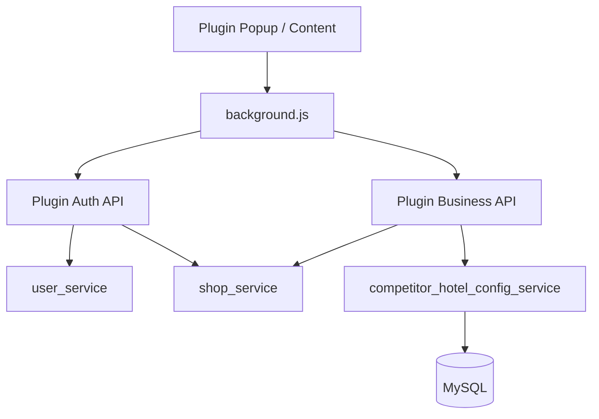

# 变更提案: plugin-multi-shop-auth

## 元信息
```yaml
类型: 新功能
方案类型: implementation
优先级: P0
状态: 已完成
创建: 2026-04-14
```

---

## 1. 需求

### 背景
当前插件以浏览器本地配置为主，直接保存 `tenantId`、`shopId` 和竞对酒店列表。这样虽然能跑通单店铺链路，但不满足“先登录再用”“一账号多店铺切换”“店铺级竞对配置入库”的业务目标，也容易造成不同店铺配置串用。

### 目标
- 插件打开后先完成账号登录，未登录时不能直接进入工作台。
- 登录成功后展示当前账号可访问的店铺列表，并允许切换当前店铺。
- 当前店铺切换后，插件所有业务请求自动绑定对应店铺。
- 每个店铺的竞对酒店配置独立保存到数据库，并按当前店铺读取、编辑、保存。
- 保持现有核心能力继续可用：按当前页采集、竞对房型价抓取、商家连接、价格映射、改价工作流。

### 约束条件
```yaml
时间约束: 本轮只改本地插件 + 本地 Flask 服务，不恢复旧 Web 控制台体系
性能约束: 插件打开后首屏鉴权与店铺加载应控制在可接受范围，避免明显卡顿
兼容性约束: 保持现有 Manifest V3 扩展结构；保留现有业务接口能力
业务约束: 竞对酒店配置必须按店铺隔离并持久化到数据库；插件不再以本地 competitorHotels 作为主数据源
```

### 验收标准
- [x] 插件未登录时显示登录页，登录成功后才进入主界面。
- [x] 已登录账号只能看到自己有权限的店铺。
- [x] 插件可切换当前店铺，切换后所有请求使用新的店铺上下文。
- [x] 每个店铺的竞对酒店配置保存到数据库，切换店铺时配置自动切换。
- [x] 现有按当前页采集、竞对房型价抓取、商家连接、价格映射功能在登录态下继续可用。
- [x] 本地存储仅保留基础连接配置与少量 UI 状态，不再作为店铺竞对配置主来源。

---

## 2. 方案

### 技术方案
采用“插件专用 Bearer Token + 当前店铺上下文 + 店铺级竞对配置表”的方案。

- 后端新增插件鉴权接口，负责登录、登出、返回当前用户、列出可访问店铺、切换当前店铺。
- 插件保存短期登录态：`authToken`、当前用户摘要、当前店铺摘要。
- 插件所有 API 请求统一由 `background.js` 代理，自动附带 `Authorization: Bearer <token>`，不再依赖手填 `tenantId/shopId` 作为主入口。
- 后端新增 `competitor_hotels`（暂定名）表，按 `tenant_id + shop_id` 管理竞对酒店详情页配置。
- 设置页改造成“当前店铺设置页”，进入时先读取当前登录态和当前店铺，再读写该店铺的竞对酒店配置。
- Popup / 页面浮层统一增加登录态判断：未登录显示引导，已登录才显示业务动作。
- 现有业务接口继续保留 `shop_id` 参数兼容，但最终以后端当前登录态和当前店铺为准做权限校验。

### 影响范围
```yaml
涉及模块:
  - browser_extension: 增加登录态、店铺切换、当前店铺配置读取与 UI 重构
  - plugin_api: 增加插件鉴权与店铺上下文接口
  - user_service: 复用用户认证与用户店铺访问关系
  - shop_service: 复用店铺查询能力并补充插件工作台所需摘要
  - competitor_config_service: 新增店铺级竞对酒店配置持久化服务
预计变更文件: 12-18
```

### 风险评估
| 风险 | 等级 | 应对 |
|------|------|------|
| 插件旧逻辑仍从本地读取 competitorHotels 导致新旧数据混用 | 高 | 统一收口到 background 配置读取；业务调用改为以后端返回配置为准 |
| 登录态丢失导致插件各动作全部 401 | 中 | 在 background 统一拦截鉴权失败并回退到登录页 |
| 店铺切换后仍残留上一个店铺缓存 | 高 | 切换店铺时清空当前页面缓存、工作流缓存、手工目标缓存并重新拉取店铺配置 |
| 现有 API 大量依赖 Header 中 tenant/shop | 中 | 先兼容 Header + Token 双路径，逐步把插件流量切到 Token |
| 数据迁移时丢失浏览器本地竞对配置 | 中 | 提供一次性“导入当前本地竞对配置到当前店铺”的迁移动作 |

---

## 3. 技术设计

### 架构设计


### API 设计

#### POST /plugin/auth/login
- **请求**:
```json
{
  "tenant_id": 1,
  "username": "demo",
  "password": "******"
}
```
- **响应**:
```json
{
  "token": "plugin_xxx",
  "user": {
    "tenant_id": 1,
    "username": "demo",
    "is_admin": false
  },
  "current_shop": {
    "shop_id": 1,
    "shop_name": "Shop 1"
  },
  "shops": [
    {
      "shop_id": 1,
      "shop_name": "Shop 1",
      "status": "enabled"
    }
  ]
}
```

#### POST /plugin/auth/logout
- **请求**: 空
- **响应**:
```json
{
  "message": "logged out"
}
```

#### GET /plugin/auth/me
- **响应**:
```json
{
  "authenticated": true,
  "user": {
    "tenant_id": 1,
    "username": "demo",
    "is_admin": false
  },
  "current_shop": {
    "shop_id": 1,
    "shop_name": "Shop 1"
  }
}
```

#### GET /plugin/auth/shops
- **响应**:
```json
{
  "items": [
    {
      "shop_id": 1,
      "shop_name": "Shop 1",
      "status": "enabled"
    }
  ]
}
```

#### POST /plugin/auth/switch-shop
- **请求**:
```json
{
  "shop_id": 2
}
```
- **响应**:
```json
{
  "current_shop": {
    "shop_id": 2,
    "shop_name": "Shop 2"
  }
}
```

#### GET /plugin/competitor/hotels
- **请求**: 当前登录 token 自动识别 tenant/shop
- **响应**:
```json
{
  "shop_id": 2,
  "items": [
    {
      "id": 10,
      "hotel_name": "杭州君悦酒店",
      "hotel_url": "https://hotel.fliggy.com/hotel_detail.htm?id=1",
      "enabled": true,
      "sort_order": 10
    }
  ]
}
```

#### POST /plugin/competitor/hotels
- **请求**:
```json
{
  "items": [
    {
      "hotel_name": "杭州君悦酒店",
      "hotel_url": "https://hotel.fliggy.com/hotel_detail.htm?id=1",
      "enabled": true,
      "sort_order": 10
    }
  ]
}
```
- **响应**:
```json
{
  "shop_id": 2,
  "saved_count": 1,
  "items": []
}
```

### 数据模型

#### plugin_auth_tokens
| 字段 | 类型 | 说明 |
|------|------|------|
| id | BIGINT | 主键 |
| token | VARCHAR(128) | 插件 Bearer Token |
| tenant_id | BIGINT | 租户 |
| user_id | BIGINT | 用户 |
| current_shop_id | BIGINT | 当前店铺 |
| expires_at | DATETIME | 过期时间 |
| last_seen_at | DATETIME | 最近访问时间 |
| created_at | DATETIME | 创建时间 |

#### competitor_hotels
| 字段 | 类型 | 说明 |
|------|------|------|
| id | BIGINT | 主键 |
| tenant_id | BIGINT | 租户 |
| shop_id | BIGINT | 店铺 |
| hotel_name | VARCHAR(128) | 竞对酒店名称 |
| hotel_url | VARCHAR(2048) | 飞猪详情页 URL |
| enabled | TINYINT(1) | 是否启用 |
| sort_order | INT | 排序 |
| created_by | BIGINT | 创建人 |
| updated_by | BIGINT | 更新人 |
| created_at | DATETIME | 创建时间 |
| updated_at | DATETIME | 更新时间 |

---

## 4. 核心场景

### 场景: 插件首次打开
**模块**: browser_extension / plugin_auth
**条件**: 本地没有有效 token
**行为**: Popup 渲染登录页，只显示后端地址、租户、用户名、密码输入与登录按钮
**结果**: 用户完成登录前不能执行采集、改价、设置动作

### 场景: 登录后进入多店铺工作台
**模块**: browser_extension / plugin_auth / shop_service
**条件**: 登录成功，账号具备一个或多个店铺访问权限
**行为**: 插件显示当前用户和店铺切换器，默认选中后端返回的当前店铺
**结果**: 后续所有请求自动绑定当前店铺

### 场景: 保存店铺竞对酒店配置
**模块**: options / competitor_hotel_config_service
**条件**: 已登录，已选择当前店铺
**行为**: 设置页提交竞对酒店列表到数据库
**结果**: 数据按 tenant/shop 隔离，切店后显示另一组配置

### 场景: 切换店铺后继续采集
**模块**: popup / content / plugin_routes
**条件**: 已登录，手动切换店铺
**行为**: background 清理旧店铺缓存并重新读取新店铺竞对配置
**结果**: 当前页采集、房型价抓取、商家动作全部写入和读取新店铺上下文

---

## 5. 技术决策

### plugin-multi-shop-auth#D001: 插件登录态采用 Bearer Token 而不是 Flask Session Cookie
**日期**: 2026-04-14
**状态**: ✅采纳
**背景**: 插件从 `chrome-extension://` 访问本地 Flask，若使用 Cookie 需要额外处理跨域与 `credentials: include` 行为，稳定性和调试复杂度较高。
**选项分析**:
| 选项 | 优点 | 缺点 |
|------|------|------|
| A: 插件 Bearer Token | 扩展请求简单、行为稳定、与插件代理层契合 | 需要补 token 表和校验逻辑 |
| B: Flask Session Cookie | 复用现有 session 概念 | 扩展跨域 Cookie 更脆弱，容易踩浏览器限制 |
**决策**: 选择方案 A
**理由**: 当前项目是本地插件优先架构，Token 更稳定、更可控，更适合多店铺切换和统一请求代理。
**影响**: `plugin_routes.py`、`deps.py`、`background.js`、`popup.js`、`content.js`

### plugin-multi-shop-auth#D002: 竞对酒店配置迁移到数据库，浏览器本地仅保留轻量配置
**日期**: 2026-04-14
**状态**: ✅采纳
**背景**: 竞对酒店配置是强店铺属性数据，保存在浏览器本地会导致不同店铺串数据，也不利于多端一致性。
**选项分析**:
| 选项 | 优点 | 缺点 |
|------|------|------|
| A: 数据库存储 competitor_hotels | 天然按店铺隔离，可多端一致 | 需要新增表和 CRUD |
| B: 继续保存在 chrome.storage | 改动小 | 无法满足多店铺隔离和登录态目标 |
**决策**: 选择方案 A
**理由**: 这是实现多店铺插件的核心前提，必须把配置从本地状态升级为后端主数据。
**影响**: `options.js`、`background.js`、新增配置服务与插件接口
