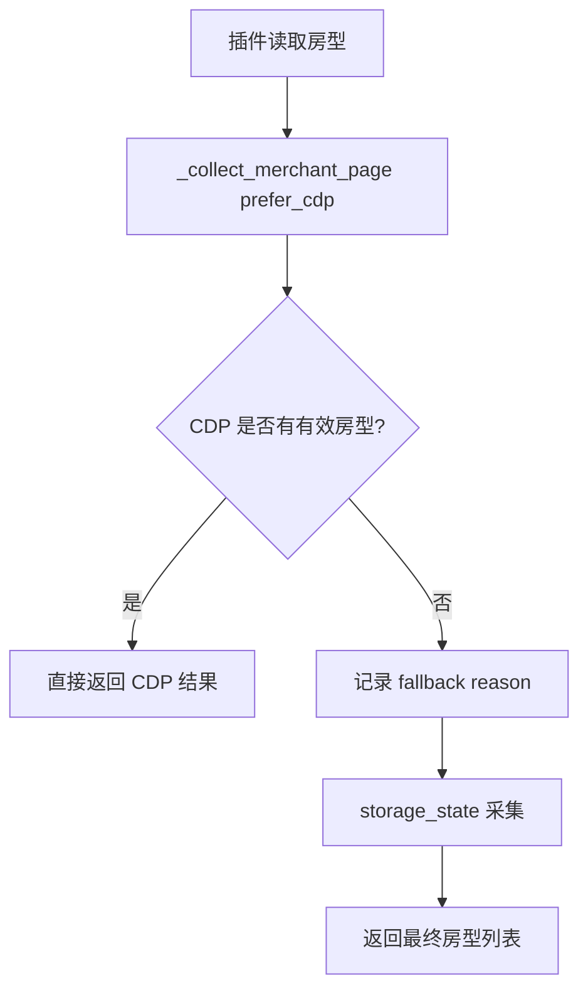

# 变更提案: merchant-pricing-cdp-empty-fallback

## 元信息
```yaml
类型: 修复
方案类型: implementation
优先级: P0
状态: 已确认
创建: 2026-04-18
```

---

## 1. 需求

### 背景
浏览器插件在商家价格页执行“读取房型”时，页面请求 `merchant_pricing_item_list` 返回 `item_count=0`，前端随之显示“房型数/已映射/部分映射/未映射”全部为 0。现有链路中，`collect_mode=prefer_cdp` 只会在 CDP 抛异常时回退到 `storage_state`，如果 CDP 成功连接但解析结果为空，会被当成成功结果直接返回，导致真实会话回退链路失效。

### 目标
- 修复 `prefer_cdp` 在 CDP 空采集场景下不会继续回退的问题。
- 保持现有前端接口与返回结构不变，仅增强后端采集容错。
- 补充自动化回归测试，覆盖“CDP 成功但返回空房型”场景。

### 约束条件
```yaml
时间约束: 本次在单轮修复内完成
性能约束: 仅在 CDP 结果为空时增加一次 storage_state 回退，不扩大正常成功路径耗时
兼容性约束: 不修改插件请求协议，不改变现有成功响应字段
业务约束: 仅修复商家房型读取链路，不变更提交流程、映射规则与前端展示逻辑
```

### 验收标准
- [ ] 当 `prefer_cdp` 连接成功但未解析到任何房型时，后端会继续尝试 `storage_state` 采集
- [ ] 当存在有效会话文件时，`merchant-items` 不再因为 CDP 空结果直接返回全 0 统计
- [ ] 回归测试覆盖 CDP 空结果回退分支，并通过定向测试验证

---

## 2. 方案

### 技术方案
在 `backend/app/services/fliggy_merchant_service.py` 的 `_collect_merchant_page()` 中收紧 `prefer_cdp` 成功判定：如果 `_collect_merchant_page_via_cdp()` 成功返回但房型列表为空，则把该结果视为“无有效采集结果”，记录 fallback reason，并继续沿用现有 `storage_state` 分支重试。这样可以保留 CDP 优先策略，同时避免真实页面结构漂移时静默返回空列表。随后在 `backend/tests/test_fliggy_merchant_service.py` 中新增回归测试，验证 CDP 空结果时会自动切回会话采集。

### 影响范围
```yaml
涉及模块:
  - merchant_pricing: 调整商家房型采集的 prefer_cdp 回退策略
  - tests: 新增回归测试覆盖 CDP 空结果 fallback
预计变更文件: 2
```

### 风险评估
| 风险 | 等级 | 应对 |
|------|------|------|
| 将真实空房型页面误判为 fallback 场景 | 中 | 仅在 `prefer_cdp` 且 `items` 为空时回退；保留原 collect_mode 标记与 fallback reason 便于诊断 |
| 没有可用 storage_state 时仍然失败 | 低 | 保持现有“需重新登录”错误，不再静默返回 0 |
| 回退逻辑影响既有成功路径 | 低 | 正常 CDP 成功且有房型时直接返回，不新增额外分支 |

---

### 架构设计


---

## 4. 核心场景

> 执行完成后同步到对应模块文档

### 场景: CDP 成功但未抓到房型
**模块**: merchant_pricing
**条件**: 插件读取房型时使用 `collect_mode=prefer_cdp`，CDP 已连接当前价格页，但解析结果 `items=[]`
**行为**: 服务层把空结果视为无效采集，自动切换到 `storage_state` 再次读取房型
**结果**: 若会话有效则返回真实房型列表；若会话无效则返回真实错误而不是全 0 统计

---

## 5. 技术决策

> 本方案涉及的技术决策，归档后成为决策的唯一完整记录

### merchant-pricing-cdp-empty-fallback#D001: prefer_cdp 空结果必须继续回退到 storage_state
**日期**: 2026-04-18
**状态**: ✅采纳
**背景**: 当前 `prefer_cdp` 只在异常时回退，CDP 成功但抓空会被误判为成功，导致读取房型界面稳定返回 0 条。
**选项分析**:
| 选项 | 优点 | 缺点 |
|------|------|------|
| A: CDP 空结果时回退到 storage_state | 命中当前故障，改动小，兼容现有接口 | 依赖本地会话文件存在 |
| B: 仅增加诊断信息，不调整回退 | 风险最低 | 不解决当前全 0 问题 |
| C: 继续扩展 CDP 选择器 | 可提升直连成功率 | 无法兜底空结果，修复不稳定 |
**决策**: 选择方案 A
**理由**: 真实故障已经定位到“CDP 空结果被当成功”，应优先修复判定条件而不是继续堆选择器或只做诊断。
**影响**: 影响 `backend/app/services/fliggy_merchant_service.py` 的回退路径，以及 `backend/tests/test_fliggy_merchant_service.py` 的回归测试
