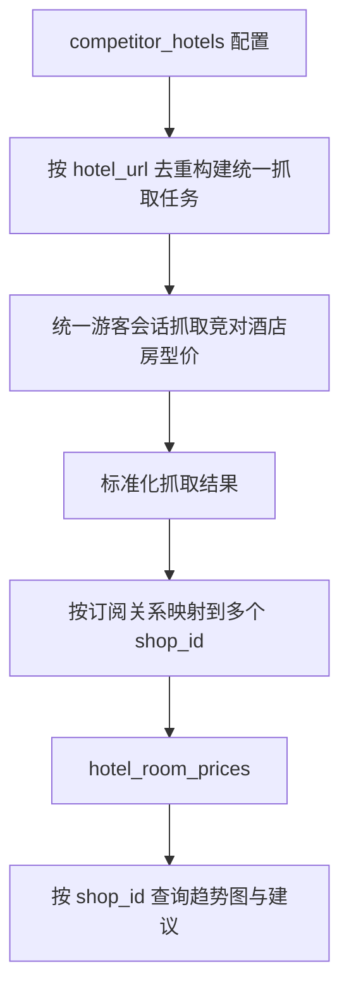

# 变更提案: unified-competitor-dispatch

## 元信息
```yaml
类型: 重构
方案类型: implementation
优先级: P1
状态: 待实施
创建: 2026-04-28
```

---

## 1. 需求

### 背景
当前竞对房型价定时任务虽然已经支持每 2 小时调度，也已经支持按 `tenant_id + shop_id` 隔离配置和查询，
但采集链路仍然是“按店铺逐个抓取，并共享一个全局 `debug_url`”。这与目标模式不一致：

- 云端应使用统一游客会话完成竞对页面抓取
- 每个酒店账号只配置自己的竞对酒店订阅
- 云端统一抓取后，再把结果分发给不同 `shop_id`
- 插件登录后继续只展示当前店铺自己的折线图和建议

现有结构会导致同一竞对酒店被不同店铺重复抓取，也不利于后续扩展统一采集池和会话管理。

### 目标
- 将定时抓取改造为“统一采集池 -> 按店铺分发结果”的云端链路
- 对所有启用店铺的竞对酒店按 `hotel_url` 去重，减少重复抓取
- 抓取结果按订阅关系写入各自 `shop_id` 的房型价历史表
- 保持现有插件账号隔离、趋势图接口、建议生成逻辑继续可用
- 不引入新的后台管理页面，以最小前端改动完成交付

### 约束条件
```yaml
时间约束: 本轮改造聚焦现有后端与插件，不扩展新的管理端页面
性能约束: 同一 hotel_url 在单次调度中最多抓取一次，避免按店铺重复抓取
兼容性约束: 保持现有 /plugin/competitor/room-price-trends 接口结构兼容
业务约束: 仍使用统一游客会话，不为每个店铺维护独立飞猪登录态
```

### 验收标准
- [ ] Celery 每 2 小时任务仍可运行，但抓取前会先汇总全部启用竞对酒店并去重
- [ ] 同一竞对酒店被多个店铺订阅时，单次调度只抓取一次，并可分发入多个 `shop_id`
- [ ] 每个账号登录插件后只读取自己店铺的折线图和建议，不会串店铺数据
- [ ] 现有趋势图维度切换（主流房型 / 酒店最低价）保持可用
- [ ] 调度与插件相关测试覆盖新的去重和分发行为

---

## 2. 方案

### 技术方案
将当前“店铺分组 -> 逐店铺抓取”的调度逻辑拆成两层：

1. 订阅汇总层
   - 从 `competitor_hotels` 读取所有启用配置
   - 生成两个视图：
     - `subscriptions_by_shop`: 每个 `shop_id` 订阅了哪些竞对酒店
     - `jobs_by_hotel_url`: 某个竞对酒店 URL 被哪些店铺订阅

2. 统一抓取层
   - 以 `hotel_url` 为唯一键，对竞对酒店去重后统一抓取
   - 抓取结果标准化为可复用结构（酒店名、URL、rooms、错误、抓取时间等）

3. 分发入库层
   - 根据 `jobs_by_hotel_url` 反查订阅店铺
   - 将同一抓取结果分别写入多个 `shop_id` 的 `hotel_room_prices`
   - 汇总每个店铺的保存数量、失败信息，用于 Celery 返回结果和测试验证

4. 前端与接口保持兼容
   - 插件仍按当前登录 token 解析 `tenant_id + current_shop_id`
   - 趋势图和建议继续按 `shop_id` 查询
   - 无需修改登录/切店铺协议，必要时只做展示兼容性回归

统一游客会话仍由现有抓取函数承接，本轮不引入新的共享快照表；优先把抓取去重与按店铺分发落地。

### 影响范围
```yaml
涉及模块:
  - competitor_scheduler: 调整统一调度、去重抓取、按店铺分发逻辑
  - competitor_service: 规范单酒店抓取结果结构，便于重复分发
  - fliggy_plugin: 校验插件趋势图和建议接口在店铺隔离下继续工作
  - browser_extension: 回归插件弹窗趋势图展示与账号切店铺后的结果读取
预计变更文件: 6-9
```

### 风险评估
| 风险 | 等级 | 应对 |
|------|------|------|
| 同一 URL 在不同店铺配置下酒店名不一致 | 中 | 以 URL 为主键，抓取结果保留原始 URL，分发时优先使用订阅配置名 |
| 分发入库导致重复历史点过多 | 中 | 仅复用单次抓取结果，不额外复制无效字段；依赖现有时间戳和趋势聚合逻辑 |
| 统一游客会话失效导致整批抓取失败 | 高 | 保持失败结果按店铺回传，避免影响插件查询；后续可再补会话状态监控 |
| 趋势图接口兼容性回归 | 中 | 保持接口 schema 不变，补插件接口与服务层测试 |

---

## 3. 技术设计（可选）

> 涉及架构变更、API设计、数据模型变更时填写

### 架构设计


### API设计
#### GET /plugin/competitor/room-price-trends
- **请求**: 保持现有 `shop_id/days/point_limit/hotel_name/series_type/include_advice`
- **响应**: 保持现有 trend summary + advice 结构，不新增强制字段

#### GET|POST /plugin/competitor/hotels
- **请求**: 保持现有按店铺保存竞对酒店列表
- **响应**: 保持现有 `shop_id + items`

### 数据模型
| 字段 | 类型 | 说明 |
|------|------|------|
| tenant_id | bigint | 竞对酒店配置所属租户 |
| shop_id | bigint | 竞对酒店配置所属店铺，也是趋势图和建议的数据隔离键 |
| hotel_url | varchar | 统一抓取任务的去重主键 |
| hotel_name | varchar | 店铺侧订阅名称，分发时可保留店铺语义 |

---

## 4. 核心场景

> 执行完成后同步到对应模块文档

### 场景: 多店铺订阅同一竞对酒店
**模块**: competitor_scheduler
**条件**: 店铺 A 与店铺 B 都启用了同一 `hotel_url`
**行为**: 调度任务只抓取一次该 URL，再将结果分别写入 A/B 的 `shop_id`
**结果**: 两个账号都能看到自己的趋势图，但云端只执行一次真实抓取

### 场景: 单账号查看自己的趋势图
**模块**: fliggy_plugin
**条件**: 插件用户已登录并绑定 `current_shop_id`
**行为**: 插件调用趋势图接口，后端按当前 `shop_id` 查询房型价历史并生成建议
**结果**: 用户只能看到自己店铺的最低价趋势、主流房型趋势与建议

### 场景: 统一游客会话抓取失败
**模块**: competitor_scheduler
**条件**: 云端游客会话失效或抓取函数报错
**行为**: 调度结果记录失败店铺与失败酒店，不中断后端服务
**结果**: 插件仍可查询历史数据，日志可定位失败原因

---

## 5. 技术决策

> 本方案涉及的技术决策，归档后成为决策的唯一完整记录

### unified-competitor-dispatch#D001: 统一抓取后按店铺分发，而不是继续逐店铺抓取
**日期**: 2026-04-28
**状态**: ✅采纳
**背景**: 当前调度虽按店铺隔离配置，但执行层仍逐店铺重复抓取，同一竞对酒店会被重复访问，不符合统一游客会话和云端集中采集目标。
**选项分析**:
| 选项 | 优点 | 缺点 |
|------|------|------|
| A: 继续逐店铺抓取 | 改动小，上线快 | 重复抓取严重，长期扩展性差 |
| B: 统一采集池后按店铺分发 | 更符合云端集中抓取目标，可去重复用结果 | 需要重构调度层和补测试 |
**决策**: 选择方案 B
**理由**: 该方案可以直接复用现有按 `shop_id` 查询趋势图与建议的基础能力，同时解决多店铺订阅同一竞对酒店的重复抓取问题，收益明显高于逐店铺抓取的小改方案。
**影响**: 主要影响 `competitor_room_price_schedule_service.py`、`competitor_service.py`、相关测试和竞对调度模块文档。
