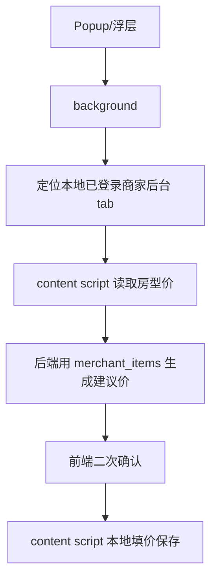

# 变更提案: local-browser-merchant-takeover

## 元信息
```yaml
类型: 优化
方案类型: implementation
优先级: P1
状态: 执行中
创建: 2026-05-07
```

---

## 1. 需求

### 背景
云端服务没有用户实际飞猪商家后台登录态时，无法可靠读取当前商家价格或执行真实改价。用户要求改为由本地插件接管已登录浏览器页面完成读取与提交，云端只提供配置与建议价计算。

### 目标
插件优先定位当前浏览器中已登录的飞猪商家后台页面，从页面 DOM 读取房型与当前价；生成建议价时将本地快照传给后端；二次确认后由本地 content script 在已登录页面填价并保存。

### 约束条件
```yaml
业务约束: 不执行真实改价测试；真实提交仍需用户二次确认
兼容性约束: Popup 与右下角浮层共用同一 runtime 消息链路
安全约束: 云端不保存或使用本次本地浏览器会话执行改价
```

### 验收标准
- [ ] `MERCHANT_PRICING_ITEMS` 优先从本地已登录商家后台 tab 读取房型价
- [ ] `COMPETITOR_WORKFLOW_PREVIEW` 使用本地商家价格快照生成建议价
- [ ] `MERCHANT_PRICING_SUBMIT_CURRENT` 二次确认后在本地商家后台 tab 执行填价保存
- [ ] 后端建议价接口支持 `merchant_items`，收到本地快照时不再自行登录抓商家页
- [ ] 静态检查与插件资产测试通过

---

## 2. 方案

### 技术方案
在 content script 增加本地商家价格页采集与提交能力；background 增加商家后台 tab 定位、本地快照采集、提交代理，并将本地快照透传给后端建议价接口。后端 `pricing` schema 和服务支持 `merchant_items`，用本地快照做映射装饰和建议价计算。

### 影响范围
```yaml
涉及模块:
  - apps/frontend/extension/content.js: 本地页面读取与提交
  - apps/frontend/extension/background.js: 本地优先编排
  - apps/backend/app/schemas/pricing.py: 请求 schema 扩展
  - apps/backend/app/api/plugin_routes.py: 透传 merchant_items
  - apps/backend/app/services/merchant_pricing_service.py: 本地快照建议价
预计变更文件: 8
```

### 风险评估
| 风险 | 等级 | 应对 |
|------|------|------|
| 真实平台改价误触发 | 高 | 仍保留前端二次确认，本轮不执行真实提交 |
| 飞猪页面 DOM 变化导致找不到行或输入框 | 中 | 返回逐房型失败原因，后续可按真实 DOM 补选择器 |
| popup 不在商家后台页打开 | 中 | background 会扫描已打开的飞猪商家后台 tab，找不到时提示先打开并登录 |

---

## 3. 技术设计

### 链路


### API设计
扩展现有请求字段：
- `merchant_items`: 本地插件采集的商家房型价快照，后端收到后跳过云端商家页抓取。

---

## 4. 核心场景

### 场景: 本地已登录浏览器完成改价
**模块**: 浏览器插件商家改价  
**条件**: 用户已在当前浏览器打开并登录飞猪商家后台 `roomsVsManage`  
**行为**: 插件生成建议价，用户二次确认后提交  
**结果**: 本地页面完成填价和保存，云端不接管商家登录态

---

## 5. 技术决策

### local-browser-merchant-takeover#D001: 本地 content script 负责真实平台操作
**日期**: 2026-05-07  
**状态**: ✅采纳  
**背景**: 云端没有用户实际商家后台登录态，真实读取与改价应复用用户本地已登录浏览器。  
**决策**: 真实读取/提交改为本地 content script 执行；后端只接收本地快照并生成建议价。  
**影响**: 降低云端登录态依赖，但要求用户本地浏览器打开且已登录商家后台。
