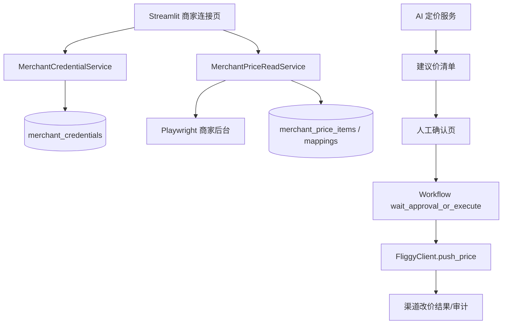

# 变更提案: merchant-ai-pricing-panel

## 元信息
```yaml
类型: 新功能
方案类型: implementation
优先级: P0
状态: 已确认
创建: 2026-03-15
```

---

## 1. 需求

### 背景
当前项目已经具备 AI 定价建议、工作流审批、商家登录测试与渠道推价模板渲染能力，但这些能力仍是分散的：
- 商家账号密码没有正式的数据模型与安全读写链路。
- 商家后台登录态与价格抓取不稳定，且未进入正式运营面板闭环。
- Streamlit 面板能生成建议价，但不能基于商家真实价格列表做“抓取 -> 建议 -> 人工确认 -> 提交”的闭环操作。
- 真实改价提交必须保留人工确认，不能默认自动执行。

### 目标
- 为商家账号、密码、登录地址、价格页地址、选择器与会话状态建立独立存储模型。
- 支持在 Streamlit 面板中完成商家连接、价格读取、AI 建议生成、待确认改价清单查看。
- 复用现有 AI 定价与工作流能力，在人工确认后才触发真实渠道改价。
- 为后续多门店、多商家、多价码映射保留扩展空间。

### 约束条件
```yaml
时间约束: 先完成单门店(shop_id=1)的最小闭环，再考虑多店扩展
性能约束: 商家抓价页面为外部站点，单次抓取允许秒级延迟，但不能阻塞核心后端流程
兼容性约束: 必须兼容当前 Flask + Streamlit + MySQL 结构，且兼容旧 shops 表历史 schema
业务约束: 真实改价必须保留人工确认闸门；敏感凭据不可在 UI 回显，不可写入日志明文
```

### 验收标准
- [ ] Streamlit 可配置并保存商家连接信息，密码写入后不在界面明文回显。
- [ ] 可通过商家后台完成自动登录并稳定读取目标价格列表，而不是误命中日历表。
- [ ] 系统能基于历史价格、当前价格、剩余库存生成待确认建议价清单。
- [ ] 用户在 Streamlit 面板确认后，系统才生成并执行真实渠道改价动作。
- [ ] 改价前后有审计记录，失败信息可追踪，且支持 dry-run/预览。

---

## 2. 方案

### 技术方案
采用“独立凭据与映射层 + 复用现有 AI/审批/渠道推价链路”的方案。

核心做法：
1. 新增独立表保存商家连接配置（账号、加密密码、登录 URL、价格页 URL、session 元信息、selectors）。
2. 新增价格项映射表，把商家页面中的房型/餐型/价码/GID/HID 与系统 shop_id 建立稳定映射。
3. 改造商家抓价服务：修正登录成功判定，支持你当前后台的专用 selectors，并把抓到的价格列表标准化输出。
4. 扩展 Streamlit：新增“商家连接”“价格管理/建议改价”面板，串联抓价、AI 建议、人工确认与提交。
5. 真实改价不走页面 DOM 点击，而是复用现有 `build_auto_pricing_action_payload -> workflow -> FliggyClient.push_price` 渠道链路。
6. 在配置写入层修复旧 `shops` 表 schema 漂移兼容问题，避免后续配置更新继续失败。

### 影响范围
```yaml
涉及模块:
  - backend/app/services/shop_service.py: 修复旧 shops 表兼容与配置读写边界
  - backend/app/services/fliggy_merchant_service.py: 商家登录、抓价、选择器与会话判定改造
  - backend/app/services/fliggy_client.py: 继续复用模板渲染与推价能力
  - backend/app/services/auto_pricing_service.py: 建议价到 action payload 的映射复用/补充字段
  - backend/app/services/workflow_service.py: 保持人工确认后提交的工作流闸门
  - backend/app/api/routes.py: 新增商家连接/价格列表/建议改价/确认提交相关接口
  - backend/streamlit_app.py: 新增商家连接和价格管理面板
  - backend/tests/*: 覆盖凭据存储、登录抓价、建议生成、人工确认提交流程
预计变更文件: 10-16
```

### 风险评估
| 风险 | 等级 | 应对 |
|------|------|------|
| 商家后台存在验证码、反自动化或 sessionStorage 依赖，导致登录态难稳定复用 | 高 | 支持人工辅助登录与会话刷新；把登录判定从“cookie存在”改为“目标业务页可访问” |
| 旧 shops 表与当前代码 schema 不一致，导致配置写入失败 | 高 | 先修复 shop 配置写入兼容层，再进行后续配置与凭据改造 |
| 凭据明文泄露到日志、接口响应或前端回显 | 高 | 密码单独加密存储；读取时只在服务内解密；接口与 UI 仅返回掩码状态 |
| 真实改价绕过人工确认直接提交 | 高 | 提交动作仅通过人工确认接口触发；默认 dry-run；保留审批/审计记录 |
| 商家页房型/价码与渠道 API 的 GID/HID 映射不稳定 | 中 | 增加人工维护映射表与 UI 校验，首次由人工确认映射后再批量使用 |

---

## 3. 技术设计（可选）

### 架构设计


### API设计
#### POST /merchant/credentials
- **请求**: `shop_id, username, password, login_url, price_url, selectors`
- **响应**: `saved, masked_username, has_password, updated_at`

#### POST /merchant/session/refresh
- **请求**: `shop_id, interactive`
- **响应**: `status, session_saved, login_mode`

#### GET /merchant/prices/current
- **请求**: `shop_id`
- **响应**: `items[]`，包含房型、价码、当前价格、日期列、映射状态

#### POST /pricing/merchant-preview
- **请求**: `shop_id, selected_items[], inventory_snapshot(optional)`
- **响应**: `preview_items[]`，包含当前价、建议价、风险等级、建议理由

#### POST /pricing/merchant-confirm
- **请求**: `shop_id, confirmed_items[]`
- **响应**: `workflow_run_id / action_ids / submitted_count`

### 数据模型
| 字段 | 类型 | 说明 |
|------|------|------|
| merchant_credentials.id | bigint | 主键 |
| merchant_credentials.shop_id | bigint | 关联门店 |
| merchant_credentials.username | varchar | 商家登录账号 |
| merchant_credentials.password_cipher | text | 加密后的密码 |
| merchant_credentials.login_url | varchar | 登录地址 |
| merchant_credentials.price_url | varchar | 价格页地址 |
| merchant_credentials.selector_json | longtext | 商家页专用 selectors |
| merchant_credentials.storage_state_name | varchar | Playwright 状态文件名 |
| merchant_credentials.last_login_at | datetime | 最近成功登录时间 |
| merchant_price_mappings.id | bigint | 主键 |
| merchant_price_mappings.shop_id | bigint | 关联门店 |
| merchant_price_mappings.room_name | varchar | 商家页房型名 |
| merchant_price_mappings.rate_name | varchar | 商家页价码名 |
| merchant_price_mappings.gid | varchar | 渠道推价业务键 |
| merchant_price_mappings.hid | varchar | 酒店业务键 |
| merchant_price_mappings.status | varchar | 映射状态 |

---

## 4. 核心场景

### 场景: 商家连接配置
**模块**: merchant credential + Streamlit
**条件**: 用户进入商家连接页面，填写账号密码与页面地址
**行为**: 系统保存凭据、掩码展示状态、允许刷新会话
**结果**: 商家连接信息可复用，密码不回显

### 场景: 商家价格抓取与 AI 建议
**模块**: merchant price read + auto pricing
**条件**: 用户已完成商家连接，且后台可访问价格页
**行为**: 系统读取价格项、结合历史数据和剩余库存生成建议价
**结果**: 面板展示待确认改价清单

### 场景: 人工确认后提交改价
**模块**: workflow + fliggy push
**条件**: 用户在面板中确认待改价项
**行为**: 系统创建/执行改价 action，通过 workflow 进入渠道推送
**结果**: 真实改价仅在人工确认后发生，并保留审计记录

---

## 5. 技术决策

### merchant-ai-pricing-panel#D001: 商家凭据采用独立表存储，而不是继续堆入 shops
**日期**: 2026-03-15
**状态**: ✅采纳
**背景**: `shops` 已存在旧库 schema 漂移；继续把账号密码、会话、selectors、映射塞入同一张表会增加兼容与安全风险。
**选项分析**:
| 选项 | 优点 | 缺点 |
|------|------|------|
| A: 独立 merchant_credentials / mappings 表 | 安全边界清晰，扩展性好，便于多商家/多映射 | 开发量更高 |
| B: 继续扩展 shops | 开发快，改动少 | 高耦合，兼容性差，敏感数据与门店配置混杂 |
**决策**: 选择方案A
**理由**: 可维护性、安全边界和后续扩展明显更优，且能绕开当前旧 schema 问题。
**影响**: 新增 DB 模型、读写服务、API 与 UI 配置页。

### merchant-ai-pricing-panel#D002: 商家网页抓价与真实渠道推价分离
**日期**: 2026-03-15
**状态**: ✅采纳
**背景**: 商家后台 DOM 容易变动且登录不稳定，但项目已具备稳定的渠道推价模板渲染能力。
**选项分析**:
| 选项 | 优点 | 缺点 |
|------|------|------|
| A: 网页仅用于抓价与校验，正式提交走渠道 API | 风险小，链路清晰，可审计 | 需要维护页面到渠道业务键映射 |
| B: 网页 DOM 直接点击提交改价 | 与页面展示一致 | 易受 DOM 变化和反自动化影响，不易审计 |
**决策**: 选择方案A
**理由**: 正式提交应走现有 `FliggyClient.push_price` 渠道能力，网页只负责读取现状和辅助映射。
**影响**: 需新增商家价格项与 GID/HID 映射层。

### merchant-ai-pricing-panel#D003: 真实改价必须保留人工确认闸门
**日期**: 2026-03-15
**状态**: ✅采纳
**背景**: 需求明确要求 AI 给建议，但最终提交由人工确认。
**选项分析**:
| 选项 | 优点 | 缺点 |
|------|------|------|
| A: 人工确认后提交 | 风险可控，符合业务要求 | 操作步骤更多 |
| B: AI 自动提交 | 流程更快 | 真实误改价风险高 |
**决策**: 选择方案A
**理由**: 外部真实价格变更属于高风险行为，必须有人审阅最终建议。
**影响**: Streamlit 需新增确认页；workflow 默认保留审批/确认边界。
