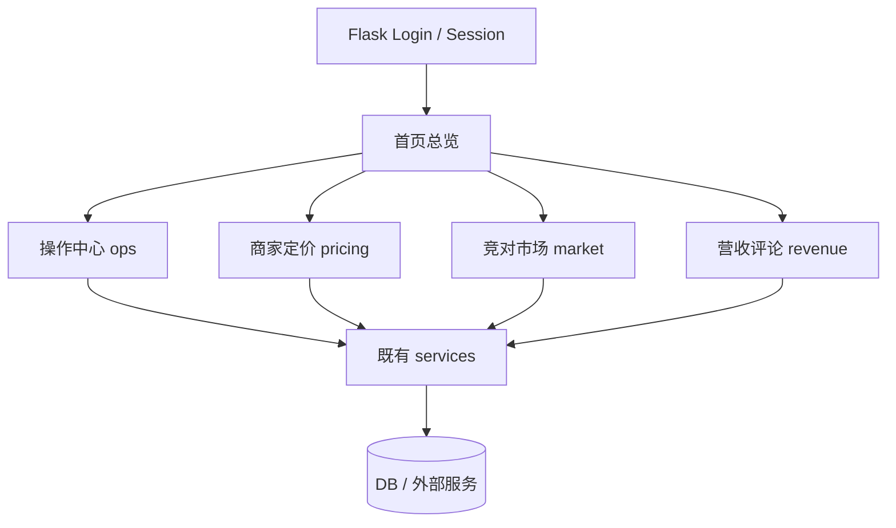

# 变更提案: streamlit-flask-consolidation

## 元信息
```yaml
类型: 重构/整合
方案类型: implementation
优先级: P1
状态: 已确认方案
创建: 2026-03-19
```

---

## 1. 需求

### 背景
当前项目同时维护 `Flask Web` 与 `Streamlit` 两套控制台入口。业务能力并非主要缺失在后端 API，而是分散在不同前端壳层中，导致入口重复、维护成本升高、功能认知不一致，并增加后续迭代与验收成本。

### 目标
- 将现有 `Streamlit` 控制面板的已实现能力整合到 `Flask Web`。
- 统一用户入口为 `Flask Web`，使登录、门店切换、功能导航、业务流程均在同一壳层完成。
- 保留并复用既有服务层与 API 能力，避免重复造轮子。
- 在功能对齐和验证完成后，下线 `Streamlit` 作为系统入口。

### 约束条件
```yaml
时间约束: 优先采用渐进式迁移，避免一次性重构导致长时间不可用。
性能约束: 不新增高频重复请求；复杂结果优先直接渲染或查询，不将大对象塞入 cookie session。
兼容性约束: 保持现有 Flask 登录态、门店切换、CSRF 机制和模板体系不被破坏。
业务约束: 商家定价、竞对采集、营收与评论相关流程必须保持现有业务语义一致；在正式下线 Streamlit 前需完成关键流程联调。
```

### 验收标准
- [ ] 所有现有 `Streamlit` 用户可用功能在 `Flask Web` 中都有明确入口。
- [ ] 商家定价主链路可在 `Flask Web` 中闭环完成：连接配置、商家登录、价格抓取、价格映射、AI 建议、人工确认或直接提交。
- [ ] 总览页可覆盖健康检查、房态、告警、日报等当前 `Streamlit` 概览能力。
- [ ] 营收记录、营收汇总、评论分析、评论历史在 `Flask Web` 中可用。
- [ ] 月度改价与自动改价相关页面在 `Flask Web` 中可用。
- [ ] 文档与导航完成更新，`Streamlit` 不再作为系统入口。

---

## 2. 方案

### 技术方案
采用“渐进式页面补齐”方案，保留现有 `Flask` 的 `web / ops / market` 分层，并新增独立的 `pricing` 业务蓝图承接商家定价与自动改价相关页面。整合过程不复制 `Streamlit` 的 `session_state` 模式，而是改为基于 `Flask` 表单提交、服务层直接调用、必要时服务端短期会话保存轻量状态的方案。

具体策略如下：
- 保留现有 `ops` 与 `market` 路由结构，避免大范围重命名与导航断裂。
- 在首页与侧边导航中扩展信息架构，使功能域按“总览 / 操作 / 商家定价 / 竞对市场 / 营收评论”统一呈现。
- 对已经存在的后端 API 能力，优先通过 `Flask web route + template` 直接接入；对现有 `web` 层已直接调用服务的模式保持一致。
- 将 `Streamlit` 中最复杂的商家定价工作流拆为可维护的多页面或分段页面，避免单页过度臃肿。
- 迁移完成并完成联调后，下线 `Streamlit` 入口与相关启动说明；`streamlit_app.py` 在验证完成前仅保留为过渡参考，不再作为系统主入口。

### 影响范围
```yaml
涉及模块:
  - backend/app/main.py: 注册新增蓝图并维护 Web 入口集合。
  - backend/app/web/routes.py: 调整首页承载能力，补总览信息。
  - backend/app/web/ops.py: 扩展总览/日报/健康检查等页面或拆出新页面。
  - backend/app/web/market.py: 保持现有竞对市场页面，并补足与商家相关的边界衔接。
  - backend/app/web/common.py: 补充表单解析、公共上下文、消息回显等公共辅助逻辑。
  - backend/app/web/pricing.py: 新增商家定价与自动改价蓝图。
  - backend/app/templates/base.html: 重构导航，加入新的功能域与入口。
  - backend/app/templates/index.html: 强化首页作为总览页的承载能力。
  - backend/app/templates/ops/*.html: 补齐总览与操作中心缺失功能页。
  - backend/app/templates/pricing/*.html: 新增商家连接、商家登录、价格抓取、价格映射、AI 建议、月度计划、自动改价等模板。
  - backend/app/templates/revenue/*.html 或 ops 子目录: 新增营收/评论页面模板。
  - backend/README.md: 更新系统入口与页面说明。
  - 启动说明，功能概述.txt: 移除 Streamlit 作为入口的歧义描述。
  - backend/streamlit_app.py: 最终标记为弃用或移除入口职责。
预计变更文件: 15-25
```

### 风险评估
| 风险 | 等级 | 应对 |
|------|------|------|
| 商家定价流程跨多个步骤，迁移时表单状态丢失 | 高 | 采用分段页面与显式提交字段，必要时仅保存轻量上下文到服务端 session，避免沿用 Streamlit session_state。 |
| 导航调整后入口变化导致用户找不到原功能 | 中 | 在首页与侧边栏按功能域重组，并在迁移阶段保留清晰跳转入口。 |
| 直接删除 Streamlit 导致未迁移边角功能丢失 | 中 | 按批次迁移并做逐项核对，完成关键流程验证后再下线入口。 |
| 页面模板过度复用导致单页逻辑臃肿 | 中 | 将商家定价拆入独立蓝图与模板目录，避免把所有逻辑堆入 `ops.py`。 |
| 文档与实际入口不一致 | 低 | 在开发完成阶段同步更新 README、启动说明与知识库记录。 |

---

## 3. 技术设计（可选）

### 架构设计


### API设计
#### GET /ops/summary
- **请求**: 基于当前登录态与当前门店，无额外 body。
- **响应**: 汇总健康检查、房态、告警、日报等信息的页面渲染结果。

#### GET/POST /ops/pricing/merchant-credentials
- **请求**: 读取或保存商家连接信息。
- **响应**: 配置回显、保存结果、错误提示。

#### GET/POST /ops/pricing/merchant-workbench
- **请求**: 分阶段执行抓取、映射、AI 建议、提价确认等动作。
- **响应**: 当前步骤结果、可继续操作的表单页面。

#### GET/POST /ops/revenue/*
- **请求**: 营收记录与查询相关表单数据。
- **响应**: 汇总结果或保存确认。

### 数据模型
| 字段 | 类型 | 说明 |
|------|------|------|
| session.shop_id | int | 当前操作门店 |
| pricing_workbench_state | dict | 仅保存轻量的步骤上下文与筛选条件，不保存大体量结果 |
| merchant_mapping_payload | dict | 价格映射保存请求 |
| review_query | dict | 评论历史查询条件 |

---

## 4. 核心场景

### 场景: 商家定价整合迁移
**模块**: `backend/app/web/pricing.py`
**条件**: 用户已登录且具备门店上下文。
**行为**: 用户在 Flask 页面中完成商家连接、会话登录、价格抓取、价格映射、AI 建议生成以及人工确认或直接提交。
**结果**: 原先依赖 Streamlit 的商家定价主链路在 Flask 中闭环完成。

### 场景: 总览页整合
**模块**: `backend/app/web/routes.py` / `backend/app/templates/index.html`
**条件**: 用户登录后进入首页。
**行为**: 页面显示门店信息、健康检查、房态、告警摘要、日报等汇总卡片，并提供到各功能域的入口。
**结果**: 首页成为统一控制台，而非仅显示门店信息与单一告警摘要。

### 场景: Streamlit 下线
**模块**: 文档、启动脚本、导航入口
**条件**: Flask 页面功能迁移完成且关键流程验证通过。
**行为**: 更新入口说明，去除 Streamlit 主入口定位，保留或清理遗留文件。
**结果**: 系统外部认知统一为 Flask Web 单入口。

---

## 5. 技术决策

### streamlit-flask-consolidation#D001: 采用渐进式页面补齐，而非一次性重写工作台
**日期**: 2026-03-19
**状态**: ✅采纳
**背景**: 当前项目后端 API 已基本具备能力，主要缺的是 Flask 页面编排。若一次性重写大工作台，风险高且交付周期不可控。
**选项分析**:
| 选项 | 优点 | 缺点 |
|------|------|------|
| A: 渐进式页面补齐 | 风险低、可分批验证、最大化复用现有 Flask 结构 | 页面数量较多，初期导航需要仔细整理 |
| B: 一次性重写统一工作台 | 体验集中、接近 Streamlit 原操作方式 | 单页复杂度高，首轮实现风险高 |
**决策**: 选择方案A
**理由**: 当前最需要的是稳妥完成功能整合与入口统一，而非追求一次性重构的理想形态。
**影响**: 主要影响 `web` 蓝图编排、模板结构与导航布局。

### streamlit-flask-consolidation#D002: 新增独立 pricing 蓝图承接商家定价能力
**日期**: 2026-03-19
**状态**: ✅采纳
**背景**: 商家定价链路比普通操作页复杂，若继续塞入 `ops.py` 或 `market.py` 会快速失控。
**选项分析**:
| 选项 | 优点 | 缺点 |
|------|------|------|
| A: 新增 pricing 蓝图 | 业务域清晰、模板与路由边界明确、便于后续扩展 | 新增文件与导航分组 |
| B: 继续堆入 ops/market | 初期文件数较少 | 业务边界混乱，维护性下降 |
**决策**: 选择方案A
**理由**: 商家定价是独立业务域，未来还会继续扩展自动改价、月度计划、审批联动等能力。
**影响**: 需要修改 `app/main.py`、新增 `app/web/pricing.py` 与对应模板目录。

### streamlit-flask-consolidation#D003: 不迁移 Streamlit session_state，改为显式表单与轻量服务端状态
**日期**: 2026-03-19
**状态**: ✅采纳
**背景**: `Streamlit` 的 `session_state` 允许同页长流程串联，但 Flask 的 cookie session 不适合承载大对象。
**选项分析**:
| 选项 | 优点 | 缺点 |
|------|------|------|
| A: 显式表单 + 直接服务调用 + 轻量 session | 与 Flask 模式一致、可维护性高、风险低 | 需要重构部分交互流程 |
| B: 模拟 Streamlit session_state | 迁移心智负担低 | 容易造成状态膨胀和模板复杂化 |
**决策**: 选择方案A
**理由**: 这是把多步工作流稳定落到 Flask 的必要前提。
**影响**: 需要在商家定价与总览整合中设计更清晰的页面边界与表单流。 
