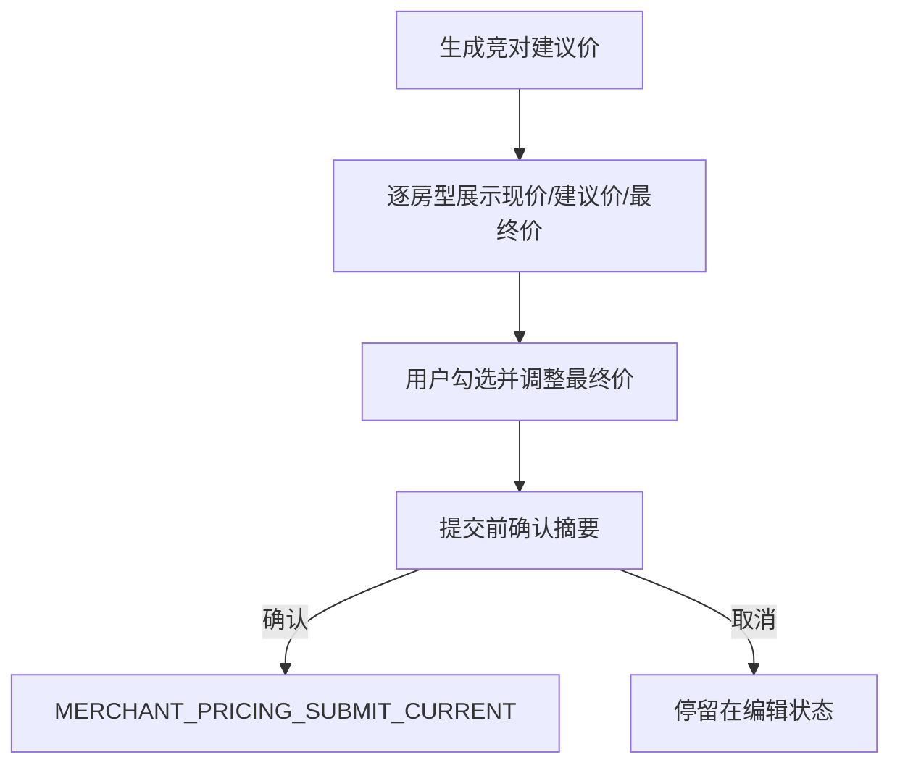

# 变更提案: one-click-room-pricing-confirm

## 元信息
```yaml
类型: 优化
方案类型: implementation
优先级: P1
状态: 已确认
创建: 2026-05-05
```

---

## 1. 需求

### 背景
当前插件已有“竞对驱动改价”和“统一目标价直接改价”两条入口。用户期望的一键改价应当是：不同房型先根据竞对价格生成建议价，允许人工修改每个房型最终价，然后再确认批量提交。现有“统一目标价直改”入口容易让用户误以为一键改价是所有房型改成同一个价格。

### 目标
- 将插件商家改价主流程收束为“生成建议价 -> 调整最终价 -> 确认提交”。
- 弱化统一目标价直改入口，避免作为默认一键改价路径。
- 提交真实 OTA/商家后台前增加人工确认摘要闸门。
- 复用现有 `/plugin/pricing/merchant-direct-submit` 和 `confirmed_items`，不新增后端提交接口。

### 约束条件
```yaml
安全约束: 涉及真实商家后台改价，必须保留人工确认闸门
兼容性约束: 保留现有插件消息协议与后端 confirmed_items 提交流程
业务约束: 未映射房型不可提交，最终价必须由用户确认
实现约束: 优先最小改动，不引入新前端框架或新依赖
```

### 验收标准
- [ ] 商家改价主文案明确表达按房型建议价、人工调整最终价、确认后提交。
- [ ] Popup 和页面浮层在提交前展示确认摘要并要求用户确认。
- [ ] 统一目标价直改不再作为主流程文案。
- [ ] 插件资产测试覆盖主流程文案、确认闸门和消息协议。
- [ ] 相关后端 pytest 与前端脚本语法检查通过。

---

## 2. 方案

### 技术方案
采用渐进式收束方案。前端保留现有 `COMPETITOR_WORKFLOW_PREVIEW` 生成建议价和 `MERCHANT_PRICING_SUBMIT_CURRENT` 提交 `confirmed_items` 的链路，新增提交前摘要确认函数。Popup 与页面浮层统一调整商家改价文案，将“统一目标价直改”调整为高级备用入口。后端暂不新增接口，继续依赖现有服务的 dry-run 预览、confirmed_items 提交与审计记录。

### 影响范围
```yaml
涉及模块:
  - apps/frontend/extension/popup.html: 商家改价主入口和备用入口文案
  - apps/frontend/extension/popup.js: 提交前确认摘要与状态文案
  - apps/frontend/extension/content.js: 页面浮层提交前确认摘要与状态文案
  - apps/backend/tests/test_browser_extension_assets.py: 插件资产行为断言
预计变更文件: 4
```

### 风险评估
| 风险 | 等级 | 应对 |
|------|------|------|
| 用户误点导致真实改价 | 高 | 提交前弹出摘要确认，明确房型数量和最终价 |
| 统一价入口仍被误用 | 中 | 文案降级为高级备用，并说明只适用于已确认统一价场景 |
| 前后端字段不一致 | 中 | 复用既有 `confirmed_items` 字段并运行现有路由/服务测试 |
| UI 信息过密 | 低 | 只展示前 5 个提交样例，完整列表仍保留在页面项中 |

---

## 3. 技术设计

### 提交流程


### API设计
复用现有插件消息与后端接口：
- `MERCHANT_PRICING_SUBMIT_CURRENT`
- `POST /plugin/pricing/merchant-direct-submit`
- 请求核心字段：`confirmed_items[].final_price`

---

## 4. 核心场景

### 场景: 按房型竞对建议价确认改价
**模块**: 浏览器插件商家改价  
**条件**: 已登录插件并选择店铺，已抓取竞对房型价，房型映射已维护或可自动匹配。  
**行为**: 用户生成建议价，调整每个房型最终价，点击确认提交。  
**结果**: 插件展示提交摘要确认，用户确认后才向后端提交 `confirmed_items`。

---

## 5. 技术决策

### one-click-room-pricing-confirm#D001: 复用 confirmed_items 提交链路
**日期**: 2026-05-05  
**状态**: ✅采纳  
**背景**: 后端已支持用户确认后的 `confirmed_items` 直接提交，且测试覆盖了不再重复预览的路径。  
**选项分析**:
| 选项 | 优点 | 缺点 |
|------|------|------|
| A: 复用现有接口 | 改动小，风险低，兼容现有审计 | 前端需把流程表达清楚 |
| B: 新增专用接口 | 语义更聚合 | 改动更大，重复包装现有能力 |
**决策**: 选择方案 A  
**理由**: 当前问题主要是入口表达和人工确认闸门不足，不需要新增后端提交能力。  
**影响**: 前端插件交互和测试更新，后端仅通过现有测试验证。
